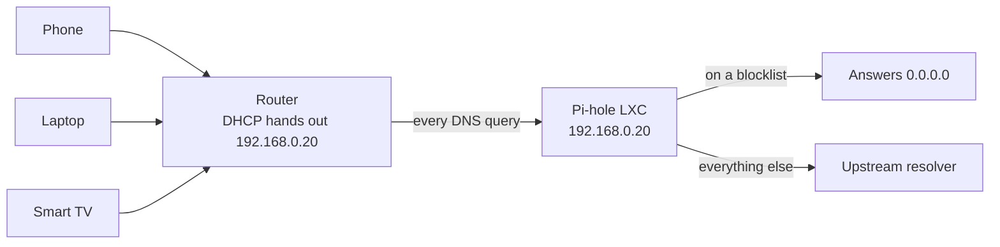
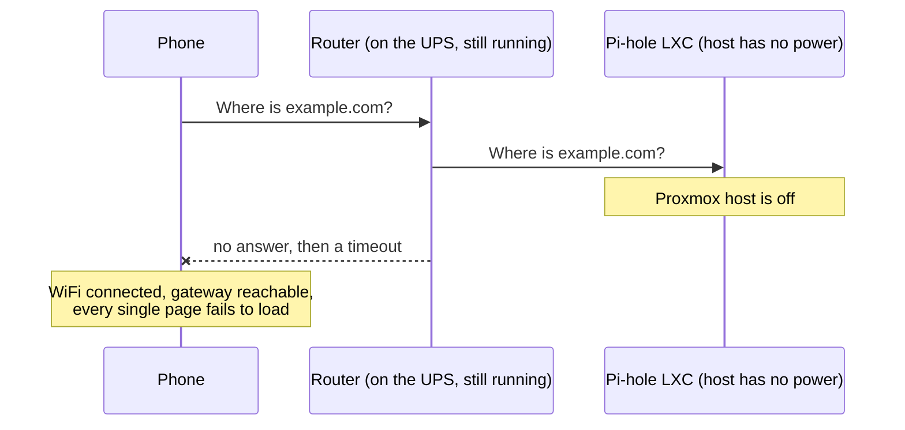
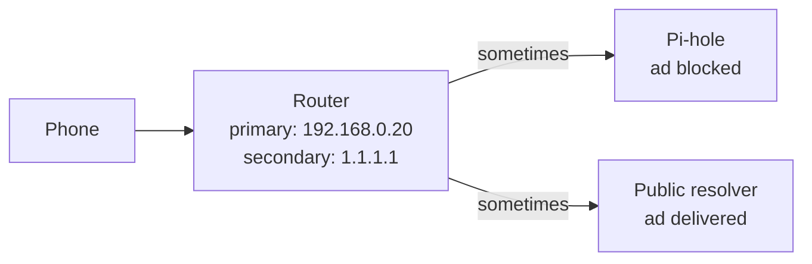
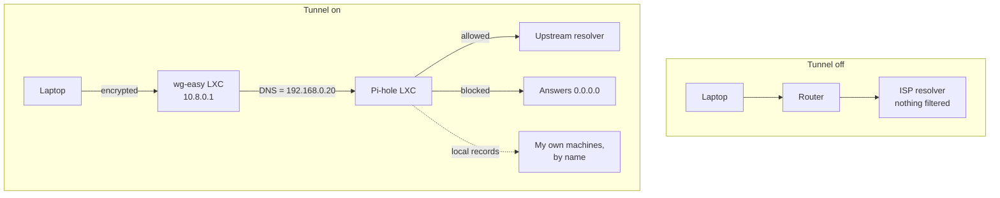

For as long as I have had a Proxmox box humming in the corner of the room, the Pi-hole on it has been the best thing running there. It is an LXC container doing almost nothing interesting: it answers DNS queries, and refuses to answer some of them. One IP address typed into the router, and every device in the house stopped seeing ads without a single one of them being told why.

Then I thought properly about what happens when the power goes out, and the whole arrangement stopped looking clever.

## One IP address in the router, and the whole house was filtered

The setup was the one everybody recommends, because it is genuinely the right one when your DNS server is a real appliance.

The Pi-hole lives in an unprivileged LXC container on the Proxmox host, with a static address on the LAN. In the router's DHCP settings I replaced the ISP's resolvers with that single address. From that moment, every device that joined the network, including ones I do not administer and ones that have no settings screen worth speaking of, was handed the Pi-hole as its resolver.



The mechanism is worth saying out loud, because the rest of this article turns on it. Pi-hole is not a firewall and it does not inspect your traffic. It is a resolver that lies. When a device asks for the address of an ad domain, Pi-hole answers with nothing useful, the connection is never attempted, and the ad never loads. Every device on the network trusts whatever resolver DHCP handed it, so controlling that one setting controls all of them.

That is exactly why it is such a good trick, and exactly why it turned out to be a problem.

## A playground server is not a server

Here is the thing I had managed not to think about. That Proxmox box is where I try things. Containers get created, broken, and destroyed on it. It gets rebooted because I changed something in the wrong place. It is on a normal wall socket with no meaningful power backup, because it is a hobby machine.

My router, on the other hand, sits on a small UPS. When the electricity goes, the router stays up. Which means the WiFi stays up, the LAN stays up, and the connection to my ISP stays up for as long as the line itself does. The one thing that does not stay up is a container on a machine that just lost power.



DNS failure is the most confusing kind of network failure, and I say that as the person who caused it. Nothing looks broken. The WiFi icon is full. The router's admin page loads, because you reach it by IP. You can ping `1.1.1.1` all day. Packets are moving perfectly. It is only names that have stopped working, and since every human-facing thing on the internet is reached by name, the experience is indistinguishable from having no internet at all.

And it was not only the power cuts. Any time I rebooted the container to change a setting, or took a snapshot, or fat-fingered something on the host, I was taking down name resolution for every device in the house. A machine whose entire purpose is to be experimented on had quietly been promoted to critical infrastructure.

## A secondary DNS server is not a backup, it is a leak

The obvious fix is the one everybody suggests first: leave the Pi-hole as the primary DNS in the router and add a public resolver as the secondary. Primary dies, secondary takes over, done.

Except that is not what a secondary DNS server is. The list a client receives is not an ordered failover chain with a promise that the second entry is only ever used when the first one is definitively dead. Different resolver implementations treat it differently. Some do try them in order, some query several at once and take whichever replies first, some rank them by observed latency, and some cache the winner and keep using it. A public resolver on the open internet will very often answer faster than a small container on your LAN doing blocklist lookups.



So the result is not failover. The result is that some fraction of queries, on some devices, at times you cannot predict, skips the Pi-hole entirely. Ads reappear in a way that looks random. Local names resolve on one device and not on another. Worse, it flips: the same domain is blocked in the morning and not in the afternoon, depending on which resolver got there first and what got cached where.

> **Note:** This is why the Pi-hole documentation tells you to configure exactly one DNS server. A hard failure is annoying but honest, and you fix it in five minutes. A soft, intermittent, cache-flavoured failure is the kind of thing you spend an evening on and still are not sure you understood.

That closed the door on the easy option. One DNS server in the router, or none.

## Typing the same IP address into three devices and giving up

If the router cannot hold the setting, the devices can. Set the Pi-hole manually as the DNS server on my desktop, my phone, my laptop, and leave the router pointing at the ISP so nothing else in the house depends on my hobby box.

That works. I did it. It is also miserable in a way that is hard to appreciate until you are doing it for the third time.

Every platform hides the setting somewhere different. On Android it is buried in the saved network's advanced settings, and it is per network, so it does not follow you. On iOS it is per network too, and it resets in ways I have never fully understood. On Windows it is in the adapter properties, one entry per adapter, so the WiFi and the ethernet port each need their own. On a laptop that docks and undocks, that is two settings that have to agree.

Then there is the reverse problem, which is the one that actually finished me off. When the Pi-hole *is* down, and it is down on purpose because I am rebuilding it, every device I configured is now broken and has to be visited again to undo the change. I had swapped one point of failure for four smaller ones and given myself manual work at both ends.

What I actually wanted was for the filtering to be something I opt into per device, with one switch, without opening network settings, and with something else responsible for putting the setting back when I turn it off.

## The resolver could just arrive with the tunnel

The idea came from a line in a config file I had been ignoring for years.

A WireGuard client configuration has a `DNS =` field in its `[Interface]` section. When the tunnel comes up, the client applies that resolver to the system. When the tunnel goes down, the client puts the old resolver back. Every WireGuard client on every platform does this, and it is the whole feature: the DNS setting has the same lifetime as the tunnel.

That is precisely the switch I was describing. It already exists, it is already in the OS, it is already one tap on a phone, and it already cleans up after itself. What I was missing was a WireGuard server on my LAN that would hand out my Pi-hole's address as that resolver.

So: a second LXC container on the same Proxmox host, running [wg-easy](https://github.com/wg-easy/wg-easy), configured to tell every client it issues that the DNS server is the Pi-hole next door.

## wg-easy in a second container, pointed at the first

wg-easy is WireGuard plus a small web UI for creating clients and printing QR codes, which is the entire reason I picked it. Adding a device is a text box and a phone camera rather than a key exchange done by hand.

I run it with Docker inside a dedicated LXC container. Two things need to be true about the container before WireGuard will work inside it at all:

```ini title="/etc/pve/lxc/<container-id>.conf"
features: nesting=1,keyctl=1
lxc.cgroup2.devices.allow: c 10:200 rwm
lxc.mount.entry: /dev/net/tun dev/net/tun none bind,create=file
```

`nesting` is what lets Docker run inside the container at all. The other two lines expose `/dev/net/tun` to it, which WireGuard needs to create its interface. Without them you get an unhelpful failure at startup that looks like a permissions problem, because it is one.

Then the compose file. The single line this whole article exists for is `WG_DEFAULT_DNS`:

```yaml title="docker-compose.yml"
services:
    wg-easy:
        image: ghcr.io/wg-easy/wg-easy:14
        container_name: wg-easy
        environment:
            - WG_HOST=vpn.example.com
            - PASSWORD_HASH=<bcrypt hash for the web UI>
            - WG_DEFAULT_ADDRESS=10.8.0.x
            - WG_DEFAULT_DNS=192.168.0.20
            - WG_ALLOWED_IPS=192.168.0.0/24, 10.8.0.0/24
            - WG_PERSISTENT_KEEPALIVE=25
        volumes:
            - ./etc_wireguard:/etc/wireguard
        ports:
            - '51820:51820/udp'
            - '51821:51821/tcp'
        cap_add:
            - NET_ADMIN
            - SYS_MODULE
        sysctls:
            - net.ipv4.ip_forward=1
            - net.ipv4.conf.all.src_valid_mark=1
        restart: unless-stopped
```

`WG_DEFAULT_DNS` is written into the `DNS =` line of every client config wg-easy generates. Point it at the Pi-hole and every device you enrol from then on gets filtered DNS for exactly as long as its tunnel is up. Newer wg-easy releases moved this into the web-based setup instead of an environment variable, but it is the same setting doing the same job.

I also set the container's own resolver to the Pi-hole, so anything the box itself looks up is filtered too. That part is housekeeping rather than the mechanism, but it means the container and its clients agree about what the world looks like.

> **Warning:** wg-easy's web UI on port `51821` is a full admin panel for your VPN. Keep it on the LAN, do not forward it from the router, and reach it through the tunnel once the tunnel exists. The only port that belongs on the internet is the UDP one WireGuard actually listens on.

## Two lines in the client config do all the work

Here is what a generated client looks like, with the two lines that matter called out:

```ini title="phone.conf"
[Interface]
PrivateKey = <client private key>
Address = 10.8.0.2/24
DNS = 192.168.0.20

[Peer]
PublicKey = <server public key>
PresharedKey = <preshared key>
AllowedIPs = 192.168.0.0/24, 10.8.0.0/24
Endpoint = vpn.example.com:51820
PersistentKeepalive = 25
```

`DNS` is the switch. `AllowedIPs` is the interesting one, because it decides how much of your traffic goes through the tunnel, and the answer turns out to be: less than you would think.

The Pi-hole lives at `192.168.0.20`, which is inside `192.168.0.0/24`. So as long as the LAN subnet is in `AllowedIPs`, DNS queries are routed into the tunnel and reach the Pi-hole. Everything else, the actual page loads, the video streams, the app traffic, keeps going out through whatever connection the device is already on. The filtering is not a side effect of tunnelling your traffic. It is the only thing being tunnelled.

| `AllowedIPs`                    | What goes through the tunnel                      | Good for                                                                        |
| ------------------------------- | ------------------------------------------------- | ------------------------------------------------------------------------------- |
| `192.168.0.0/24, 10.8.0.0/24`   | DNS and anything on my LAN. Nothing else.         | At home, or on mobile data. Blocking with almost no bandwidth or battery cost.  |
| `0.0.0.0/0, ::/0`               | Everything.                                       | Hostile WiFi, where I want the whole session going home first.                  |

I keep the split-tunnel form as the default on my everyday clients and a separate full-tunnel client for cafe and airport WiFi. They are two entries in the same app, which costs nothing to maintain.



The router, meanwhile, went back to the ISP's resolvers. Nothing in the house depends on the Proxmox box any more.

## The Pi-hole has to be told the tunnel is a friend

There is one setting that will make all of this look broken while every part of it is working, and it is worth knowing about before you spend an evening on it.

Pi-hole's DNS listening behaviour defaults to allowing only local requests, meaning queries whose source address is in the same subnet as one of its own interfaces. Tunnel clients are on `10.8.0.0/24`. The Pi-hole is on `192.168.0.0/24`. If those queries arrive with their original source address, the Pi-hole considers them foreign and drops them without answering, and your client sits there resolving nothing at all with a perfectly healthy tunnel.

There are two ways out, and they are a genuine trade-off rather than a right answer:

- **Let wg-easy masquerade the traffic.** This is the default. The container rewrites the source address of tunnel traffic to its own LAN address, so from the Pi-hole's point of view every query arrives from a neighbour and the local-only rule is satisfied. Nothing to configure. The cost is that every tunnel client shows up in the Pi-hole query log as the same IP, so per-device statistics and per-device blocking stop being possible.
- **Turn masquerading off, add a route, and permit all origins.** Give the router a static route for `10.8.0.0/24` via the wg-easy container, stop rewriting the source, and set the Pi-hole's listening behaviour to permit all origins. Now every client keeps its own tunnel address, and the query log tells you which device asked for what. That is more setup, and "permit all origins" is only reasonable because the Pi-hole is not reachable from outside the LAN.

> **Note:** If you take the second route, make sure it really is only reachable from inside. An open resolver on the public internet gets found within hours and conscripted into DNS amplification attacks. Permitting all origins is a statement about your LAN, not about the internet.

## The part I did not plan for: my machines have names now

This was a side effect, and it turned out to be the thing I use most.

Pi-hole will serve local DNS records, mapping a name you invent to an address on your LAN. So the Proxmox host is not `192.168.0.10` any more, and none of my services are a port number I have to remember:

| Name         | Points at      |
| ------------ | -------------- |
| `pve.home`   | the Proxmox host |
| `pihole.home` | the Pi-hole admin UI |
| `vpn.home`   | the wg-easy UI |

Setting them in the router-wide arrangement meant they only worked at home. Now they arrive with the tunnel, so they work from anywhere the tunnel does. I can be out of the house, flip the switch, and type `pve.home` into a browser exactly as if I were sitting in front of the machine. That is the split tunnel earning its keep: two subnets in `AllowedIPs`, and my homelab follows me around.

## What this still does not fix

I want to be straight about the limits, because there are several and none of them are subtle.

- **The devices that most need filtering are the ones that cannot run WireGuard.** The smart TV, the various things with a chip in them that phone home. They are on the ISP's resolvers now and nobody is filtering them. Under the old setup they were covered.
- **Filtering is opt-in, which means it is off by default.** If the tunnel is off, I see ads. That is the entire design and also its biggest hole, because the switch only helps when you remember it exists.
- **The Proxmox box is still a single point of failure, just for less.** If it is down, the tunnel does not come up. The difference is what that costs: a feature I chose to turn on does not work, instead of the whole house losing name resolution while the router sits there on its UPS looking fine.
- **Browsers can go around it entirely.** Secure DNS in Chrome and Firefox sends lookups over HTTPS to a resolver of the browser's choosing and never asks the system resolver. If a browser is still showing ads with the tunnel up, that setting is the first thing to check.
- **This is not high availability.** A second Pi-hole on a small always-on machine, with both configured through the router, is the actual answer to the failure I started with. I did not build that, because it means another box and keeping two blocklists in sync.

## Good enough, chosen on purpose

None of this is the correct solution. The correct solution is redundant resolvers on hardware that stays up, and I know that.

What I built instead did something more useful to me than being correct: it moved the blast radius. The question was never really "how do I block ads". It was "what breaks when my playground machine goes down", and the honest answer used to be "everything, for everyone in the house, in the most confusing way possible". Now the answer is "a switch on my own devices stops doing anything, and I am the only person who notices".

I still get the ad blocking. I get my local names, and I get them from outside the house, which I did not have before. The router holds a setting that will keep working whether or not I am in the middle of rebuilding something. And the cost is a toggle I flip roughly once a day and mostly forget is there.

There is a version of homelab work that is about building the right architecture, and there is a version that is about noticing which failures you can actually live with. This was the second kind. It is not the perfect answer. It is comfortably the right one for the way I actually use my network.
