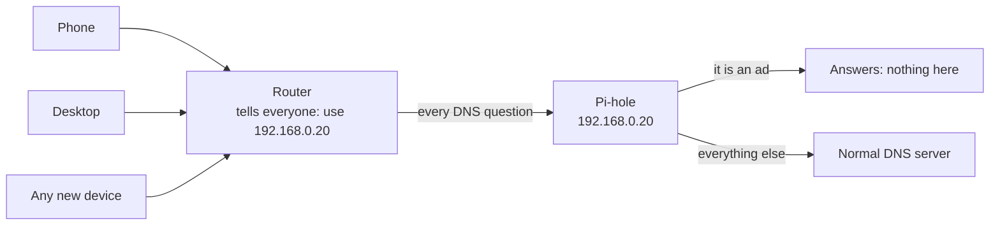
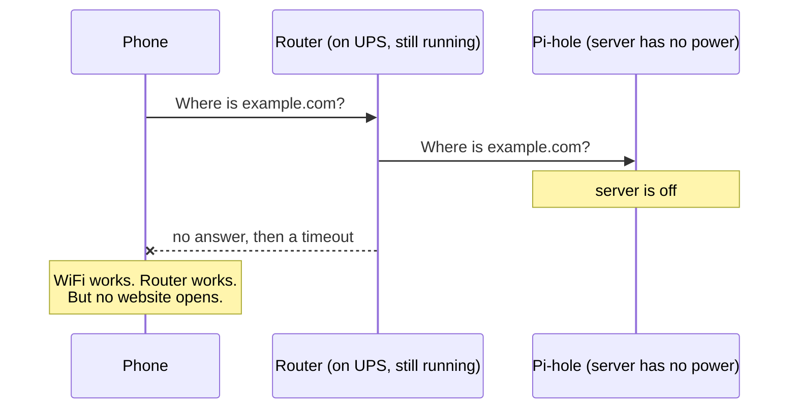
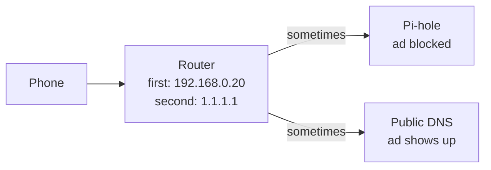
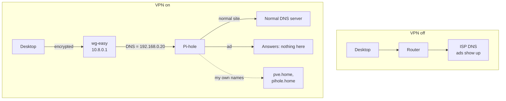

My Proxmox server sits in the corner of my room. The best thing running on it is Pi-hole. It is a small container with one job: it answers DNS questions, and it refuses to answer the ones that belong to ads.

I typed its IP address into my router once. After that, every device in my house stopped seeing ads, and none of them had to be told anything.

Then one day I looked at that setup and thought: what happens when this server is off? I did not wait to find out by accident. I walked over and cut its power to see.

## One line in my router, and all the ads were gone

Let me explain the piece that everything here depends on.

Every time you open a website, your device asks a question first: "what is the IP address for this name?" The thing that answers is called a DNS server. Your device cannot reach anything by name until something answers that question.

Pi-hole is a DNS server that lies on purpose. When the question is about an ad or tracker domain, Pi-hole answers "nothing here". Your browser then has nowhere to connect, so the ad never loads. It never sees your traffic and it never blocks anything else. It just gives a useless answer to questions it does not like.

My setup was the normal one. Pi-hole runs in an LXC container on my Proxmox server with a fixed address, `192.168.0.20`. In my router settings, I removed my ISP's DNS servers and put that one address instead. From then on, the router told every device that joined the WiFi to use Pi-hole.



One setting, and everything on the network was covered. Devices I never touched. Devices that have no way to block ads on their own. Anything that connected later, without me doing a thing.

## I turned the server off on purpose to see what would break

Power cuts are normal here, so this was not a hard thing to imagine. What made me stop and think was which machines survive one.

My router is plugged into a small UPS. When the electricity goes, the router keeps running. The WiFi stays on. The line to my ISP stays up.

My Proxmox server is not on a UPS. It is my playground machine. I create containers on it, break them, and delete them. I reboot it when I change the wrong thing. It has no backup power, because it is a hobby machine.

So on paper, a power cut leaves me with a working router and no Pi-hole. And Pi-hole was the only DNS server every device in the house knew about.

I wanted to see it rather than assume it, so I switched the server off myself and picked up my phone.



It was worse than I expected, and that is the useful part of doing the test.

I knew websites would stop opening. What I had not pictured was how healthy everything else would look. The WiFi icon was full. The router page opened fine, because you reach it by IP address. `1.1.1.1` answered every ping. The network was working perfectly. Only names had stopped working, and since we reach everything by name, it felt exactly like having no internet at all.

If that had happened during a real power cut, at night, I would not have started by suspecting DNS. I would have blamed the ISP and wasted an hour. Knowing that in advance was worth the two minutes the test took.

And it was not only power cuts. Every time I rebooted that container to change a setting, I was taking DNS away from everyone in the house. My toy machine had quietly become something the whole home depended on.

## Adding a second DNS server made it worse

The first idea everybody has is simple. Keep Pi-hole as the first DNS server in the router, and add a public one like `1.1.1.1` as the second. If the first one dies, the second takes over.

That sounds right, but it is not how it works.

A second DNS server is not a backup that waits its turn. Your device is free to use either one, whenever it wants. Some devices try them in order. Some ask both at the same time and use whichever replies first. Some remember which one was faster and keep using that one. A big public DNS server is usually faster than a small container in your house.



So you do not get a backup. You get leaks. Some questions skip Pi-hole completely. Ads come back, but only sometimes. A local name works on one device and not on another. And because answers get cached, the same website is blocked in the morning and not blocked in the afternoon.

> **Note:** This is why the Pi-hole docs tell you to set only one DNS server. A clear failure is annoying, but you fix it in five minutes. A random failure that comes and goes will eat your whole evening, and you still will not be sure you understood it.

So the choice was simple: one DNS server in the router, or none at all.

## I set the DNS by hand on each device, and hated it

If the router cannot hold the setting, the devices can. I could leave the router on my ISP's DNS, so nothing in the house depends on my server, and set Pi-hole by hand only on my own devices.

That works. I did it. It is also painful in a way you only feel by the third device.

Every system hides the setting somewhere different. On Android it is inside the saved WiFi network's advanced settings, and it only applies to that one network. On iPhone it is also per network. On Windows it is in the adapter settings, and the WiFi and the cable port each need their own copy. If a machine uses both, that is two settings that have to agree.

Then comes the part that finished me off. When Pi-hole is actually down, and it is down because I am rebuilding it on purpose, every device I configured is now broken. I have to go back to each one and undo the setting, then set it again later.

I had turned one big problem into four small ones, and given myself manual work at both ends.

What I really wanted was a switch. Turn filtering on when I want it. Turn it off when I do not. No network settings, and something else should clean up after me.

## The idea: let the VPN carry the DNS setting

The answer was in a line I had been ignoring for years.

A WireGuard config file has a `DNS =` line in it. When you turn the VPN on, your device starts using that DNS server. When you turn the VPN off, your device goes back to whatever it was using before. Every WireGuard app on every platform does this automatically.

That is exactly the switch I wanted. It already exists. It is one tap on a phone. And it puts the old setting back by itself.

The only missing piece was a WireGuard server in my house that would tell its clients "use the Pi-hole next door".

So I added a second LXC container on the same Proxmox server, running [wg-easy](https://github.com/wg-easy/wg-easy).

## Setting up wg-easy in a second container

wg-easy is WireGuard plus a small web page for managing it. That web page is the reason I chose it. Adding a new device means typing a name and scanning a QR code with your phone, instead of copying keys around by hand.

I run it with Docker inside its own LXC container. Two things must be true about the container before WireGuard will work inside it:

```ini title="/etc/pve/lxc/<container-id>.conf"
features: nesting=1,keyctl=1
lxc.cgroup2.devices.allow: c 10:200 rwm
lxc.mount.entry: /dev/net/tun dev/net/tun none bind,create=file
```

The first line lets Docker run inside the container at all. The other two give the container access to `/dev/net/tun`, which WireGuard needs to create its network interface. Without them you get a confusing error at startup that looks like a permission problem, because it is one.

Then the Docker setup. The one line this whole article is about is `WG_DEFAULT_DNS`:

```yaml title="docker-compose.yml"
services:
    wg-easy:
        image: ghcr.io/wg-easy/wg-easy:14
        container_name: wg-easy
        environment:
            - WG_HOST=vpn.example.com
            - PASSWORD_HASH=<hash for the web page login>
            - WG_DEFAULT_ADDRESS=10.8.0.x
            - WG_DEFAULT_DNS=192.168.0.20
            - WG_ALLOWED_IPS=192.168.0.0/24, 10.8.0.0/24
            - WG_PERSISTENT_KEEPALIVE=25
        volumes:
            - ./etc_wireguard:/etc/wireguard
        ports:
            - '51820:51820/udp'
            - '51821:51821/tcp'
        cap_add:
            - NET_ADMIN
            - SYS_MODULE
        sysctls:
            - net.ipv4.ip_forward=1
            - net.ipv4.conf.all.src_valid_mark=1
        restart: unless-stopped
```

`WG_DEFAULT_DNS` is the Pi-hole's address. wg-easy writes it into the `DNS =` line of every client file it creates. So every device I add gets filtered DNS for as long as its VPN is on, and normal DNS the moment it turns off. Newer versions of wg-easy ask for this in the web setup instead of an environment variable, but it is the same setting doing the same job.

I also set the container itself to use Pi-hole as its DNS, so anything the box looks up is filtered too.

> **Warning:** The wg-easy web page on port `51821` can manage your whole VPN. Keep it inside your home network. Do not forward that port in your router. Once the VPN works, you can reach the page through the VPN itself. The only port that should face the internet is the UDP one WireGuard listens on.

## The two lines that matter in the client file

Here is what a client file looks like:

```ini title="phone.conf"
[Interface]
PrivateKey = <client private key>
Address = 10.8.0.2/24
DNS = 192.168.0.20

[Peer]
PublicKey = <server public key>
PresharedKey = <preshared key>
AllowedIPs = 192.168.0.0/24, 10.8.0.0/24
Endpoint = vpn.example.com:51820
PersistentKeepalive = 25
```

`DNS` is the switch. That is the ad blocking, right there.

`AllowedIPs` is the interesting one. It decides which traffic goes through the VPN. And you need less than you might think.

Pi-hole is at `192.168.0.20`, which is inside `192.168.0.0/24`. So as long as that range is listed, DNS questions travel through the VPN and reach Pi-hole. Everything else, the actual web pages, the videos, the app data, goes out the normal way. You are not sending your whole internet through your house. You are only sending the questions.

| What you put in `AllowedIPs`  | What goes through the VPN                     | When to use it                                          |
| ----------------------------- | --------------------------------------------- | -------------------------------------------------------- |
| `192.168.0.0/24, 10.8.0.0/24` | DNS and my home network. Nothing else.        | Every day. Almost no effect on speed or battery.        |
| `0.0.0.0/0, ::/0`             | Everything.                                   | Public WiFi, when I want all traffic to go home first.  |

I keep the first one as my normal setup, and a second client with the full option for cafe and airport WiFi. They are just two entries in the same app.



And my router went back to my ISP's DNS servers. Nothing in the house depends on the Proxmox box any more.

## Pi-hole ignores the VPN until you tell it not to

There is one setting that will make all of this look broken while every part of it is actually working. It is worth knowing before you lose an evening to it.

By default, Pi-hole only answers devices on its own network. VPN clients are on `10.8.0.0/24`. Pi-hole is on `192.168.0.0/24`. Those are different networks. If the questions arrive with their original address, Pi-hole treats them as strangers and throws them away without replying. Your VPN connects fine and nothing resolves.

There are two ways around it, and they are a real trade-off:

- **Let wg-easy rewrite the addresses.** This is the default behavior. The container replaces the sender address on VPN traffic with its own home network address. Pi-hole then sees a neighbor asking, and answers normally. Nothing to configure. The cost is that all your VPN devices look like one device in the Pi-hole logs, so you lose per-device statistics.
- **Turn that off and let Pi-hole accept everyone.** Add a route in your router for `10.8.0.0/24` pointing at the wg-easy container, stop rewriting addresses, and change Pi-hole's setting to permit all origins. Now each device keeps its own address and shows up separately in the logs. It is more setup, and it only makes sense because Pi-hole is not reachable from outside your home.

> **Note:** If you choose the second option, make sure Pi-hole really is unreachable from the internet. A DNS server that answers anybody gets found quickly and used by strangers to attack other people. Permitting all origins is a decision about your home network, not about the internet.

## A bonus: my machines have names now

I did not plan this part, and it is the thing I use most.

Pi-hole can hold your own DNS names, pointing at addresses in your home. So I stopped remembering IP addresses:

| Name          | Goes to              |
| ------------- | -------------------- |
| `pve.home`    | the Proxmox server   |
| `pihole.home` | the Pi-hole web page |
| `vpn.home`    | the wg-easy web page |

When Pi-hole was set in the router, these names only worked at home. Now they come with the VPN, so they work anywhere. I can be out of the house, turn the VPN on, and type `pve.home` in my browser as if I were sitting in front of the machine.

## What this still does not fix

I want to be honest about the holes, because there are several.

- **Anything that cannot run WireGuard is no longer covered.** A device with no VPN app, or one you cannot install software on, now uses my ISP's DNS and nobody filters it. The old setup covered every device on the network without asking any of them. This one only covers the devices I set up by hand.
- **Blocking is off by default now.** If the VPN is off, I see ads. That is the whole design, but it is also its weakest part, because a switch only helps when you remember it is there.
- **The Proxmox server can still fail, but it costs much less.** If it is off, the VPN does not connect. That is it. Before, the whole house lost DNS while the router sat there on its UPS looking perfectly healthy.
- **Browsers can go around it.** Chrome and Firefox have a "secure DNS" feature that sends DNS questions straight to their own server over HTTPS and ignores your system setting. If you still see ads with the VPN on, check that first.
- **This is not a proper backup plan.** The real fix for my original problem is a second Pi-hole on a small machine that always stays on. I did not build that, because it means another box and keeping two blocklists in sync.

## Not perfect, but right for me

None of this is the correct solution, and I know it. The correct solution is two DNS servers on hardware that stays up.

But what I built did something more useful to me than being correct. It changed how much breaks when things go wrong.

The real question was never "how do I block ads". It was "what happens when my playground server goes down". The old answer was "everything stops, for everyone in the house, in the most confusing way possible". The new answer is "a switch on my own devices stops working, and I am the only one who notices".

I still get my ad blocking. I get my own names, and now they work from outside the house too. My router holds a setting that keeps working no matter what I am breaking on the server. The whole cost is one toggle I press about once a day and mostly forget about.

Some homelab work is about building the right thing. Some of it is about noticing which failures you can live with. This was the second kind, and for the way I actually use my network, it is enough.
