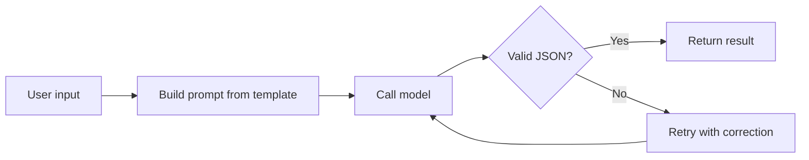

A prompt is an interface. In a demo you can tweak wording by feel, but in production you need structures that behave the same way every run. These patterns get you there.

## A request pipeline

Wrapping the model in validation and a retry keeps a single bad generation from breaking the feature.



## Frame the role and task

State who the model is and what done looks like before the input. Vague instructions get vague output:

```text
You are a support classifier. Read the message and return one
label from: billing, technical, account. Return only the label.
```

## Ask for structured output

Request JSON and validate it, so downstream code parses instead of guessing:

```ts src/ai/classify.ts
const schema = z.object({
    label: z.enum(['billing', 'technical', 'account']),
    confidence: z.number().min(0).max(1),
});

export function parseResult(raw: string) {
    return schema.parse(JSON.parse(raw));
}
```

## Show, do not just tell

A couple of few-shot examples pin the format far better than another paragraph of instruction. Include an edge case among them.

## Keep prompts in version control

Treat prompts like code: store them in files, review changes, and note which model and settings each was tuned for.

## A prompt template module

Role framing, examples, and an output contract in one file:

https://gist.github.com/octocat/6cad326836d38bd3a7ae

Pin the role, demand structure, validate the output, and version everything. Reliability comes from the scaffolding around the prompt.
