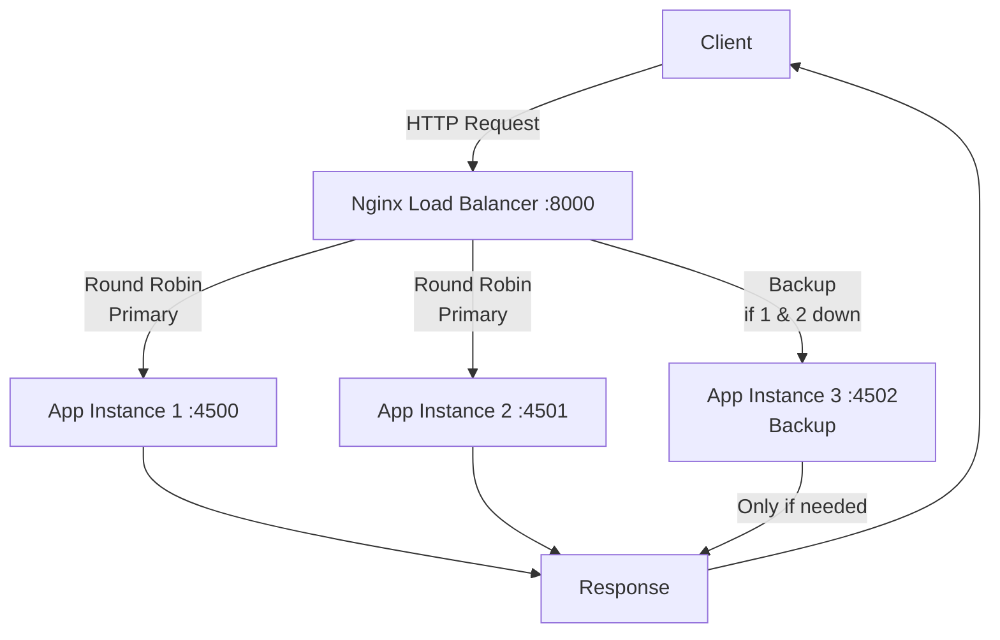

Retrieval-augmented generation (RAG) grounds a language model in your own data, so answers stay accurate and current without retraining. Here is the pipeline I reach for.

## The four stages

1. Chunk the source documents into passages.
2. Embed each chunk into a vector.
3. Store the vectors in Qdrant for fast similarity search.
4. Retrieve the top matches and pass them to Gemini as context.


1. **Build the Docker Image**: Use the `Dockerfile` to build the Docker image for the Express application.
   ```sh
   docker build -t express-lb .
   ```

## Request Workflow Diagram



## Searching with Qdrant

Qdrant returns the nearest neighbours for a query embedding in milliseconds:

```ts src/lib/foo.ts
const hits = await client.search('articles', {
    vector: queryEmbedding,
    limit: 5,
});
```

Feed those passages into the prompt and let the model answer from them. The result is grounded, cite-able output that keeps improving as your corpus grows.


## Request Workflow Diagram


## VS Code Laravel

https://gist.github.com/shibbirweb/529577ce5437c6a10953c81308957cc3