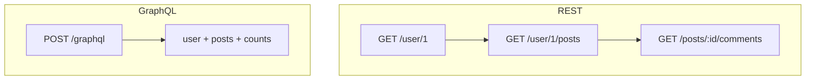

REST exposes resources at URLs. GraphQL exposes one endpoint and lets the client ask for exactly the fields it needs. Neither is universally better; they fit different client needs.

## One round trip versus many

A screen that needs a user plus their posts plus comment counts is several REST calls, or one GraphQL query.



## A GraphQL query

The client declares the shape it wants and gets exactly that back, no more:

```graphql
query {
    user(id: "1") {
        name
        posts {
            title
            commentCount
        }
    }
}
```

## The resolver behind it

Each field maps to a resolver on the server:

```ts src/graphql/resolvers.ts
export const resolvers = {
    User: {
        posts: (user) => db.post.findMany({ where: { authorId: user.id } }),
    },
    Query: {
        user: (_, { id }) => db.user.findUnique({ where: { id } }),
    },
};
```

## Watch the N+1 problem

Naive resolvers fire one query per parent row. A batching loader (DataLoader) collapses them into one. REST avoids this by shaping responses up front.

## When REST is the right call

For simple CRUD, public caching by URL, or file uploads, REST stays easier to build and operate. Reach for GraphQL when clients are varied and over-fetching is real.

## A schema and server starter

A minimal schema-first server to clone:

https://gist.github.com/octocat/6cad326836d38bd3a7ae

Pick by your clients. One flexible front end with many views leans GraphQL; a handful of stable endpoints leans REST.
