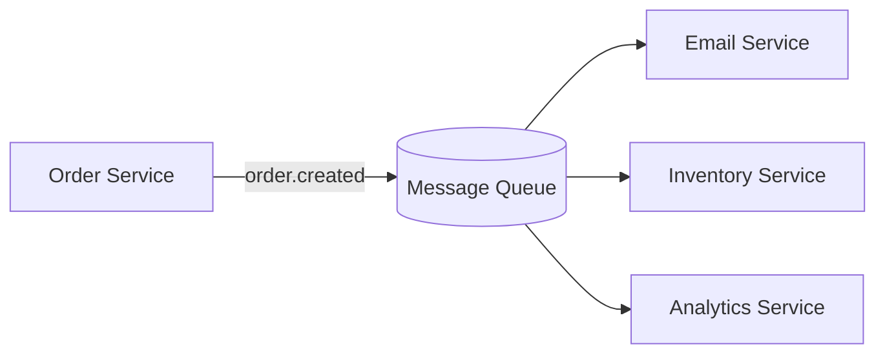

When service A calls service B directly, A is only as available as B. Publishing an event to a queue instead lets each service work at its own pace and survive the other being down.

## Publish and consume

The producer drops an event on the queue and moves on. Consumers pick it up when they are ready.



## Publishing an event

The producer does not know or care who consumes the message:

```ts src/orders/publish.ts
import amqp from 'amqplib';

export async function publishOrderCreated(orderId: string) {
    const conn = await amqp.connect(process.env.AMQP_URL!);
    const channel = await conn.createChannel();
    await channel.assertExchange('orders', 'fanout', { durable: true });
    channel.publish('orders', '', Buffer.from(JSON.stringify({ orderId })));
}
```

## Consuming safely

A consumer acknowledges a message only after it finishes the work, so a crash mid-process leaves the message on the queue for retry:

```ts src/email/consume.ts
channel.consume('email_queue', async (msg) => {
    if (!msg) return;
    const { orderId } = JSON.parse(msg.content.toString());
    await sendConfirmation(orderId);
    channel.ack(msg);
});
```

## Plan for duplicates

Delivery is at-least-once, so make consumers idempotent. Keying on the order id and skipping work already done is usually enough.

## A durable queue setup

Exchange, queue, and dead-letter config in one snippet:

https://gist.github.com/octocat/6cad326836d38bd3a7ae

Events trade tight coupling for eventual consistency. For most workflows that is a trade worth making.
