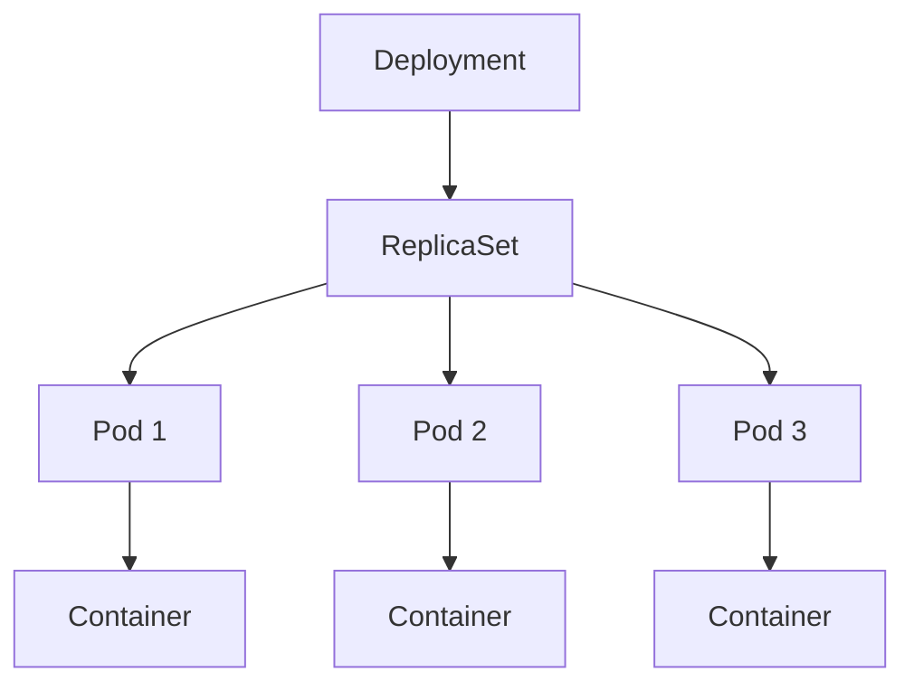

Kubernetes runs containers for you and keeps them running. You declare the desired state, and the control loop works to match it. A Deployment is the object you use for stateless apps.

## The object hierarchy

A Deployment manages a ReplicaSet, which manages the Pods that actually run your containers.



## Declaring a Deployment

The manifest says which image to run and how many replicas to keep alive:

```yaml k8s/deployment.yaml
apiVersion: apps/v1
kind: Deployment
metadata:
  name: web
spec:
  replicas: 3
  selector:
    matchLabels:
      app: web
  template:
    metadata:
      labels:
        app: web
    spec:
      containers:
        - name: web
          image: registry.example.com/web:1.4.0
          ports:
            - containerPort: 8080
```

## Applying and watching

Apply the manifest and watch the rollout converge:

```sh
kubectl apply -f k8s/deployment.yaml
kubectl rollout status deployment/web
```

## Rolling updates come free

Change the image tag and re-apply. Kubernetes replaces Pods gradually, so there is no downtime if your readiness probe is honest.

## A Service to expose it

Pairing the Deployment with a Service manifest gives it a stable address:

https://gist.github.com/octocat/6cad326836d38bd3a7ae

Declare what you want, let the control loop reconcile, and lean on rolling updates and probes for safe releases.
