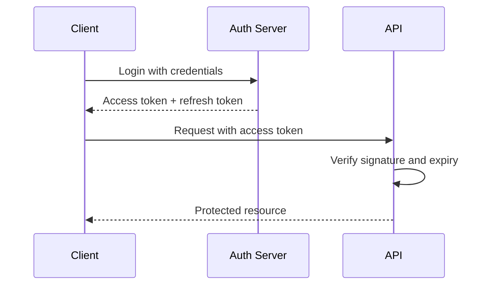

A JSON Web Token is a signed claim about who the caller is. The server signs it at login, the client sends it on every request, and the server verifies the signature instead of looking up a session.

## The token lifecycle



## What is inside a token

A JWT has three parts: a header, a payload of claims, and a signature. The payload is encoded, not encrypted, so never put secrets in it:

```json
{
    "sub": "user_123",
    "role": "editor",
    "exp": 1735689600
}
```

## Verifying on each request

Verification checks the signature and the expiry before trusting any claim:

```ts src/middleware/auth.ts
import jwt from 'jsonwebtoken';

export function verifyToken(token: string) {
    try {
        return jwt.verify(token, process.env.JWT_SECRET!);
    } catch {
        throw new Error('Invalid or expired token');
    }
}
```

## Keep access tokens short

Give the access token a short expiry (minutes) and use a longer-lived refresh token to mint new ones. If an access token leaks, the window of abuse stays small.

## A complete auth flow

Login, refresh, and logout handlers in one place:

https://gist.github.com/octocat/6cad326836d38bd3a7ae

Sign with a strong secret, verify every request, and rotate refresh tokens. The rest is just plumbing.
