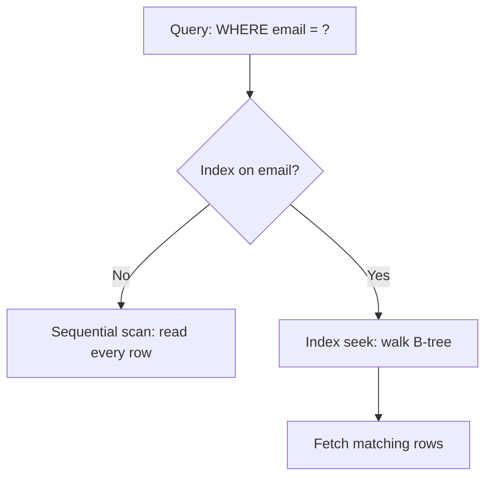

An index is a sorted structure the database keeps beside your table so it can find rows without reading every one. The trade is faster reads for slightly slower writes and more disk.

## Scan versus seek

Without an index the engine scans the whole table. With one, it walks a B-tree and jumps straight to the matching rows.



## Creating the index

Index the columns you filter and join on most often:

```sql migrations/add_users_email_index.sql
CREATE INDEX CONCURRENTLY idx_users_email
    ON users (email);
```

`CONCURRENTLY` builds the index without locking writes, which matters on a live table.

## Reading the plan

`EXPLAIN ANALYZE` tells you whether the index is actually used:

```sql
EXPLAIN ANALYZE
SELECT * FROM users WHERE email = 'a@example.com';
```

Look for `Index Scan` instead of `Seq Scan` in the output.

## Composite and partial indexes

A composite index on `(tenant_id, created_at)` serves queries that filter by tenant and sort by date. A partial index narrows to a subset:

```sql
CREATE INDEX idx_active_orders
    ON orders (created_at)
    WHERE status = 'active';
```

## Do not over-index

Every index is updated on each write and consumes cache. Drop the ones your slow-query log never benefits from.

## A worked tuning example

This walkthrough pairs a slow query with the index that fixes it:

https://gist.github.com/octocat/6cad326836d38bd3a7ae

Index the access patterns you actually run, measure with `EXPLAIN`, and prune what you do not need.
