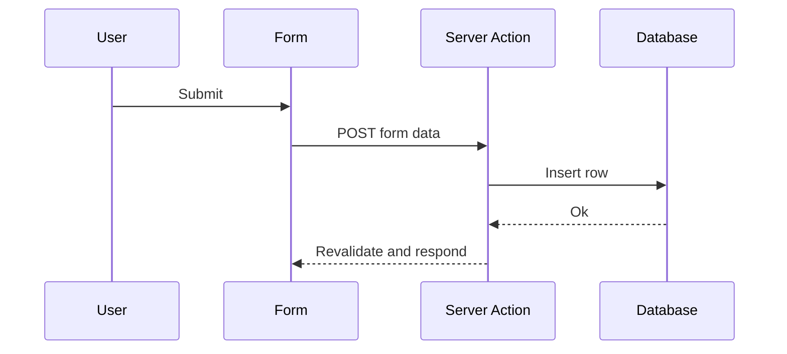

Server Actions turn a function into a form endpoint. You write the mutation next to the component, mark it server-only, and Next.js wires up the request for you.

## The request flow

The form posts straight to the action, which runs on the server and can revalidate the affected data.



## Defining the action

The `'use server'` directive marks the function as a server boundary:

```ts app/actions.ts
'use server';

import { revalidatePath } from 'next/cache';

export async function createComment(formData: FormData) {
    const body = String(formData.get('body') ?? '').trim();
    if (!body) return;

    await db.comment.create({ data: { body } });
    revalidatePath('/comments');
}
```

## Wiring it to a form

Pass the action to the form's `action` prop. It works without JavaScript, then upgrades when JS loads:

```tsx app/comments/Form.tsx
import { createComment } from '@/app/actions';

export default function CommentForm() {
    return (
        <form action={createComment}>
            <textarea name="body" required />
            <button type="submit">Post</button>
        </form>
    );
}
```

## Validate on the server

Never trust the client. Validate inside the action and return a typed error shape your UI can render.

## A fuller example

A complete action with validation and optimistic UI is worth bookmarking:

https://gist.github.com/octocat/6cad326836d38bd3a7ae

Server Actions remove a whole layer of glue code. Reach for them whenever a form just needs to mutate and revalidate.
