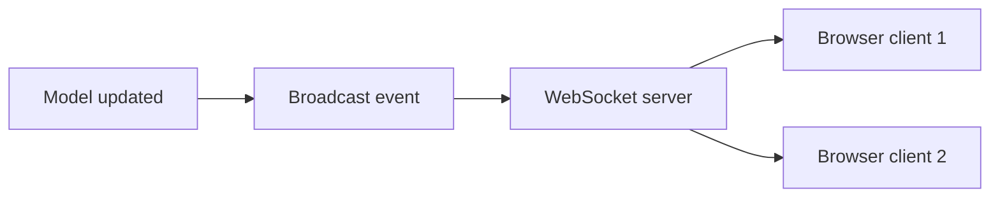

Sample text of the article

## How the pieces fit

A model change fires an event, the event broadcasts on a channel, and every subscribed client receives it instantly.



## Broadcasting an event

Mark the event with `ShouldBroadcast` and Laravel queues it for delivery:

```php app/Events/OrderShipped.php
<?php

namespace App\Events;

use Illuminate\Broadcasting\Channel;
use Illuminate\Contracts\Broadcasting\ShouldBroadcast;

class OrderShipped implements ShouldBroadcast
{
    public function __construct(public int $orderId) {}

    public function broadcastOn(): Channel
    {
        return new Channel('orders');
    }
}
```

## Listening on the client

Echo subscribes to the channel and runs a callback for each event:

```ts resources/js/orders.ts
import Echo from 'laravel-echo';

window.Echo.channel('orders').listen('OrderShipped', (event) => {
    console.log(`Order ${event.orderId} shipped`);
});
```

## Keep channels authorized

Private channels run through an auth callback, so only the right user receives sensitive updates. Public channels like the one above are fine for non-sensitive broadcasts.

## Reference configuration

A full broadcasting config, including the queue connection, is worth keeping handy:

https://gist.github.com/octocat/6cad326836d38bd3a7ae

Start with one channel and a single event, confirm the round trip works, then grow from there.
