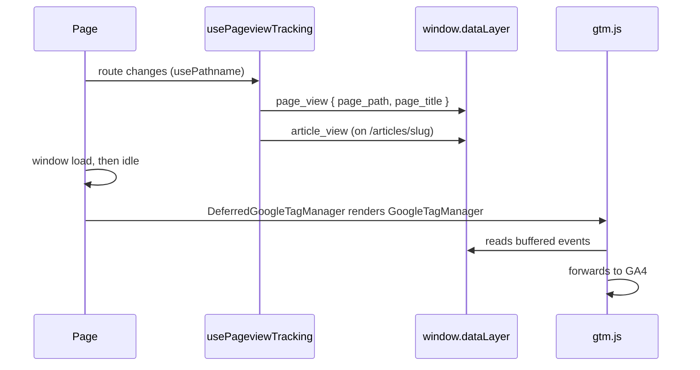

# Analytics

> **In short:** Google Tag Manager (GTM) loads late, after the page is idle, so it does not slow the first paint. A small tracker pushes a `page_view` event on every route change. Both only run in production.

## Files involved

| File                                                                    | What it does                                     |
| ----------------------------------------------------------------------- | ------------------------------------------------ |
| `src/components/analytics/DeferredGoogleTagManager/index.tsx`           | Loads GTM after `load` and an idle moment.       |
| `src/components/analytics/PageviewTracker/index.tsx`                    | Mounts the tracking hook.                        |
| `src/components/analytics/PageviewTracker/hooks/usePageviewTracking.ts` | Sends `page_view` and `article_view` events.     |
| `src/config/constants.ts`                                               | `googleTagManagerId` (`GTM-W4DC9Z6`).            |
| `src/app/layout.tsx`                                                    | Mounts both, only when `NODE_ENV` is production. |

## How it works

1. `DeferredGoogleTagManager` waits for the window `load` event, then `requestIdleCallback` (or a short timeout). Only then does it render `GoogleTagManager` from `@next/third-parties`. This keeps the large `gtm.js` out of the Largest Contentful Paint window.
2. `usePageviewTracking` runs on the first load and every client navigation. It sends `page_view` with the path (no query string) and `document.title`.
3. On `/articles/<slug>` (but not `/articles/search`) it also sends `article_view` with the slug and title.
4. Events sent before GTM loads wait in `window.dataLayer`. Nothing is lost.

## Good to know

- **No events in dev.** The layout gates both components on `process.env.NODE_ENV === 'production'`.
- **GTM setup lives outside this repo.** The container should use Custom Event triggers for `page_view` and `article_view`, and **not** GTM's built in Page View trigger, or every view is counted twice.
- **No `.env` file is needed.** The GTM ID is a constant.
- The spec with the full rules is `openspec/specs/analytics/spec.md`.

## Related pages

- [Root layout](Root-Layout.md)
- [PWA and offline](PWA-and-Offline.md) (why third party requests skip the service worker)
