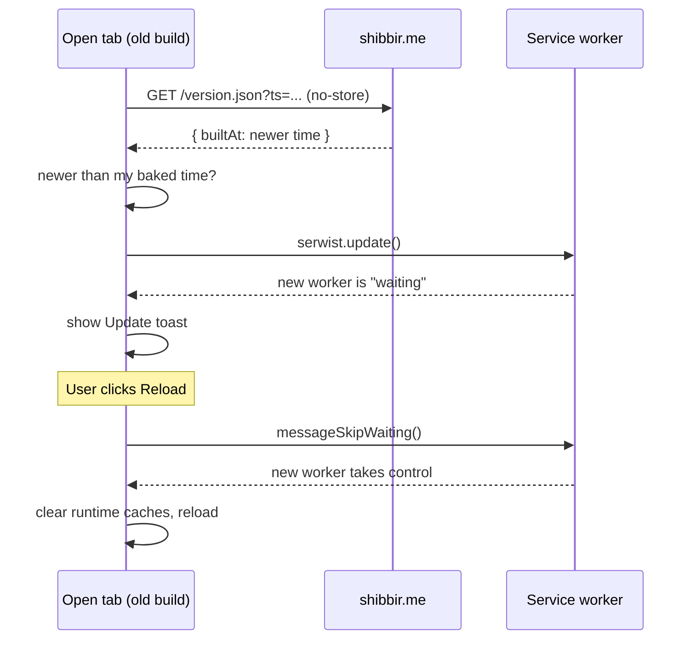

# App updates

> **In short:** Every build is stamped with its build time. An open tab checks `/version.json`. If a newer build is live, an "Update available" toast appears. Clicking **Reload** swaps in the new service worker and reloads the page.

## Files involved

| File                                                                | What it does                                                 |
| ------------------------------------------------------------------- | ------------------------------------------------------------ |
| `next.config.ts`                                                    | Sets `NEXT_PUBLIC_BUILD_TIME` to the build time.             |
| `src/lib/version.ts`                                                | `getBuiltAt()` returns that time stamp.                      |
| `src/app/version.json/route.ts`                                     | Writes `/version.json` as `{ "builtAt": "..." }`.            |
| `src/components/pwa/ServiceWorkerManager/index.tsx`                 | Shows the toast when an update is ready.                     |
| `src/components/pwa/ServiceWorkerManager/hooks/useServiceWorker.ts` | Registers the worker, polls for new builds, applies updates. |
| `src/components/pwa/UpdateToast/`                                   | The toast UI with Reload and Dismiss buttons.                |

## How a new deploy is found

1. `next.config.ts` bakes the build time into the client code. Git is not involved, so it works the same locally and in CI.
2. `useServiceWorker` fetches `/version.json` with a unique query string and `cache: 'no-store'`.
3. It checks on page load, every 60 seconds, when the tab becomes visible again, and when the network comes back.
4. If the live `builtAt` is later than the baked one, it calls `serwist.update()` to fetch the new worker straight away.
5. The browser can also find a new worker by itself. Either way, the `waiting` event sets `updateReady`.
6. `ServiceWorkerManager` shows `UpdateToast`.

## What Reload does

1. It calls `messageSkipWaiting()`. The worker is built with `skipWaiting: false`, so it waits for this message and never swaps by surprise.
2. When the new worker takes control, the `controlling` handler runs once.
3. It deletes every cache **except** the precache (`clearRuntimeCaches`), so no old pages stay around.
4. It reloads the page.

**Dismiss** only hides the toast for now. It comes back after a reload if the update is still waiting.

## Good to know

- **Nothing reloads without the user clicking.** This is a rule from `openspec/specs/pwa/spec.md`. The `controlling` handler only reloads after `applyUpdate` ran, because a first visit also fires `controlling` (the worker claims the page), and reloading then would wipe what the visitor typed.
- **`updateViaCache: 'none'`** makes the browser always fetch a fresh `sw.js`. Without it, a cached old `sw.js` could point to deleted files and fail to install.
- **Pin the time stamp** by setting `NEXT_PUBLIC_BUILD_TIME` yourself. Useful to compare two builds byte for byte.
- The toast is mounted last inside the main wrapper in `layout.tsx`, so it floats over content and parks above the footer.

## Related pages

- [PWA and offline](PWA-and-Offline.md)
- [Root layout](Root-Layout.md)
