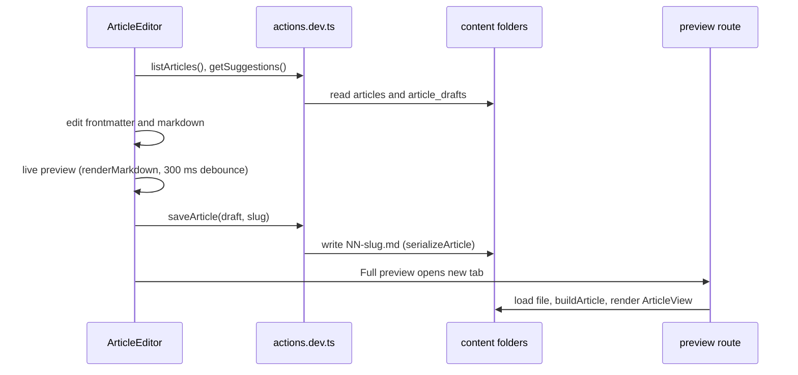

# Article editor studio

> **In short:** `/studio/article-editor` is a writing tool that only exists in `pnpm dev`. It edits article files on disk with Server Actions, shows a live preview with the real renderer, and has a writing guide with ready snippets.

## Files involved

| File                                                         | What it does                                                |
| ------------------------------------------------------------ | ----------------------------------------------------------- |
| `src/app/studio/article-editor/page.dev.tsx`                 | The route. Passes the actions to the editor.                |
| `src/app/studio/article-editor/actions.dev.ts`               | Server Actions: list, load, save, delete, suggestions.      |
| `src/app/studio/article-editor/preview/[slug]/page.dev.tsx`  | Full preview using the real `ArticleView`.                  |
| `src/app/studio/article-editor/preview/[slug]/loader.dev.ts` | Loads an article or draft for preview.                      |
| `src/components/pages/article-editor/ArticleEditor/`         | The editor UI and its hooks.                                |
| `src/utils/articleFile.ts`                                   | `serializeArticle`, `parseArticleFile`, `nextNumberPrefix`. |

## Why it never ships

`next.config.ts` adds `dev.tsx` and `dev.ts` to `pageExtensions` only in dev. In production those files are not routes, so the editor and its Node code are left out of the static export. The navbar "Studio" menu is also dev only. See [Build and deploy](Build-and-Deploy.md).

## How it works

## Where files go

- Published: `content/articles/NN-slug.md`.
- Drafts: `content/article_drafts/NN-slug.md` (created on first draft save).
- Ticking **Draft** moves the file to the drafts folder, and the other copy is deleted. The folder is the source of truth for draft status.
- A new file gets the next number (`nextNumberPrefix`). Saving an existing slug keeps its number.
- Slugs with `/` or `..` are rejected.

## Editor parts

| Part                       | What it does                                                           |
| -------------------------- | ---------------------------------------------------------------------- |
| `FrontmatterForm`          | All fields. Tags, tech, and learn use `TagListInput` with suggestions. |
| `MarkdownInput`            | Mono textarea. Tab inserts 4 spaces.                                   |
| `EditorPreview`            | Live preview with diagrams, code copy, lightbox, and TOC.              |
| `WritingGuide`             | Modal listing every feature with Insert and Copy buttons.              |
| `SaveBar`                  | File name, New, Open, Guide, preview toggles, Save, Delete.            |
| `useUnsavedChangesWarning` | Warns before closing the tab with unsaved changes.                     |
| `useMarkdownInsertion`     | Inserts a snippet at the cursor.                                       |
| `useArticleActions`        | Save state and list refresh.                                           |

## How to change it

- **New markdown feature?** Add its snippet to `WritingGuide/contents.ts`, so writers can find it.
- **New frontmatter field?** Update `articleSchema.ts`, `serializeArticle` (field order), `FrontmatterForm`, and `posts.ts`.

## Good to know

- **Full preview saves first**, because the preview route reads from disk.
- **Gists do not load in the live preview** (browser blocks it). The full preview and the build fetch them.
- The editor gets its actions as props, because `src/components/` must not import from `src/app/`.

## Related pages

- [Article markdown](Article-Markdown.md)
- [Articles overview](Articles-Overview.md)
