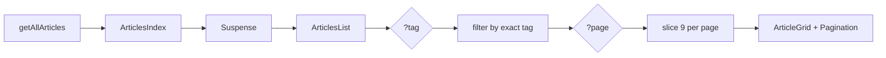
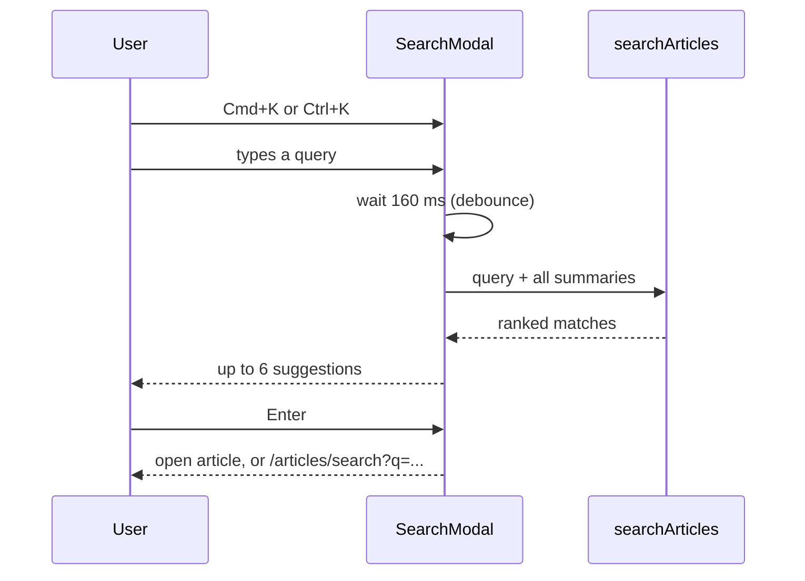

# Article listing and search

> **In short:** `/articles` is one static page. Tag filter and pagination use query strings (`?tag=Git&page=2`) and run in the browser. Search also runs in the browser over titles, tags, and descriptions. No search index file is built.

## Files involved

All component paths are under `src/components/pages/articles/`.

| File                               | What it does                                          |
| ---------------------------------- | ----------------------------------------------------- |
| `src/app/articles/page.tsx`        | Loads all articles and tags, renders `ArticlesIndex`. |
| `src/app/articles/search/page.tsx` | The results page. Marked `noindex`.                   |
| `ArticlesIndex.tsx`                | Page layout. Wraps the list in `<Suspense>`.          |
| `ArticlesList.tsx`                 | Reads `?tag` and `?page`, filters and slices.         |
| `TagFilter.tsx`, `Pagination.tsx`  | Tag pills and page links.                             |
| `ArticleGrid.tsx`, `ArticleCard/`  | The card grid.                                        |
| `ArticleSearch/`                   | Search box, `Cmd+K` modal, suggestions.               |
| `SearchResults/`                   | Results list on `/articles/search?q=...`.             |
| `src/utils/searchArticles.ts`      | The scoring function.                                 |
| `src/utils/pageHref.ts`            | Builds page links and keeps other query params.       |

## Listing

1. The route passes **every** article summary to the client.
2. `ArticlesList` reads `?tag=` and `?page=` with `useSearchParams`.
3. It filters by the exact tag, then shows 9 per page (`ARTICLES_PER_PAGE` in `posts.ts`).
4. A bad page number falls back to page 1.
5. `useSearchParams` needs a `<Suspense>` wrapper in a static export. The fallback (first page, no filter) is what ends up in the HTML, so crawlers and no JS visitors see page 1.

**Cards** show the cover, a series badge, date, reading time, title, description, and tag links. The cover colours tint the hover glow.

## Search

**Scoring** (`searchArticles.ts`). Every word must match somewhere:

| Match                   | Points |
| ----------------------- | ------ |
| Title equals query      | 100    |
| Title starts with query | 40     |
| Title contains a word   | 20     |
| Tag equals a word       | 30     |
| Tag contains a word     | 12     |
| Description contains    | 4      |

Ties go to the newest post. The article body is **not** searched.

**Modal.** Opens with `Cmd+K` (Mac) or `Ctrl+K`. Arrow keys move, Enter opens, Escape closes. Focus is trapped inside while open. Matched words are wrapped in `<mark>`.

**Results page.** `/articles/search?q=...&page=2` reads the query on the client and shows three states: empty, no match, or results.

## Good to know

- **Search works only where `ArticleSearch` is mounted**: `/articles` and `/articles/search`.
- **Big article counts** mean a bigger page, since all summaries ship in the HTML payload.
- `getArticlesForPage` and `getArticlePageCount` in `posts.ts` are not used anywhere.

## Related pages

- [Articles overview](Articles-Overview.md)
- [Article page](Article-Page.md)
