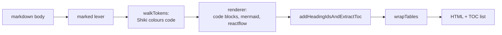

# Article markdown

> **In short:** An article is YAML frontmatter plus a markdown body. `src/lib/markdown.ts` uses `marked` with extra extensions and Shiki to turn the body into HTML at build time.

## Files involved

| File                                                                         | What it does                                    |
| ---------------------------------------------------------------------------- | ----------------------------------------------- |
| `src/lib/articleSchema.ts`                                                   | The frontmatter contract.                       |
| `src/utils/articleFile.ts`                                                   | `serializeArticle`: the exact YAML house style. |
| `src/lib/markdown.ts`                                                        | The markdown pipeline.                          |
| `src/components/pages/article-editor/ArticleEditor/WritingGuide/contents.ts` | Every supported feature, with snippets.         |
| `src/components/pages/articles/ArticleContent/ArticleContent.module.css`     | Styles for the rendered HTML.                   |

## Frontmatter fields

| Field         | Type                                   | Needed?         | What it does                                                           |
| ------------- | -------------------------------------- | --------------- | ---------------------------------------------------------------------- |
| `title`       | string                                 | yes             | Page title and `h1`.                                                   |
| `description` | string                                 | yes             | Card text, meta description, feed summary.                             |
| `date`        | `'YYYY-MM-DD'`                         | yes (published) | Publish date. Checked at build.                                        |
| `updated`     | `'YYYY-MM-DD'`                         | no              | Shown as "Updated" when it differs from `date`.                        |
| `tags`        | string[]                               | yes             | Filters, feed categories, related posts. `tags[0]` is the cover label. |
| `cover`       | path in `public/`                      | no              | Leave it out to get a generated cover.                                 |
| `category`    | string                                 | no              | Related post score, OG section.                                        |
| `difficulty`  | `Beginner`, `Intermediate`, `Advanced` | no              | Difficulty badge.                                                      |
| `tech`        | string[]                               | yes             | The "Stack" strip and SEO keywords.                                    |
| `learn`       | string[]                               | yes             | The "What you'll learn" card.                                          |
| `series`      | `{ name, order }`                      | no              | Series tracker and "Part N" badge.                                     |
| `draft`       | `true`                                 | no              | Hides the post. Only write it when true.                               |

House style: single quoted values, inline `tags` and `tech` arrays, `learn` items indented 4 spaces. Field order follows `serializeArticle`.

## The markdown pipeline



## Supported body features

- **Code fences.** Shiki colours them at build with `github-light` and `github-dark`. Add a file name like ` ```ts src/app/page.tsx ` or ` ```ts title="path" `. Each block gets a language badge and a copy button slot.
- **Mermaid.** ` ```mermaid ` blocks are left as source for the browser. See [Mermaid diagrams](Mermaid-Diagrams.md).
- **Flow diagrams.** ` ```reactflow ` blocks use a custom syntax. See [Flow diagrams](Flow-Diagrams.md).
- **Callouts.** House style is `> **Note:**` and `> **Warning:**`. GitHub alerts (`> [!NOTE]`) also work.
- **Footnotes.** `text[^1]` and `[^1]: note`.
- **Emoji.** `:rocket:` becomes the real emoji character.
- **Highlight** `==text==`, **subscript** `~x~`, **superscript** `^x^`.
- **Definition lists.** A term line, then `: definition` lines.
- **Gists.** A line with only a gist URL is fetched and embedded at build. If the fetch fails, it becomes a plain link.
- **Tables** are wrapped so they scroll sideways on small screens.

## Headings and the TOC

- Use `##` and `###` only. No `#` (the title is the `h1`). `####` and below get no anchor and no TOC entry.
- Ids come from the heading text (`My heading` becomes `my-heading`). Repeats get `-2`, `-3`.
- Set your own id with `## My heading {#custom-id}`.
- Use sentence case, no ending punctuation, no emoji.

## Good to know

- **Check diagrams in the browser.** A broken mermaid block quietly shows as plain text. Always look at it rendered.
- **Unknown code languages** fall back to plain text colours.
- **Gists do not load in the editor preview**, because the browser blocks the request. They work in the build.
- The writing rules (true stories, no template headings, no roadmap intro) are in `CLAUDE.md`.

## Related pages

- [Articles overview](Articles-Overview.md)
- [Article page](Article-Page.md)
- [Article editor studio](Article-Editor-Studio.md)
