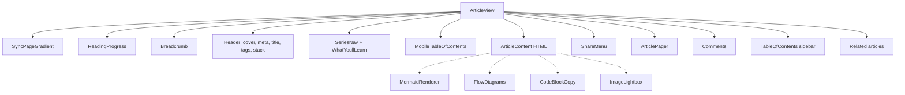

# Article page

> **In short:** `/articles/[slug]` is built once per published article. `ArticleView` lays out the header, the body HTML, and many small client helpers that add features on top of that HTML.

## Files involved

All component paths are under `src/components/pages/articles/`.

| File                                                      | What it does                                                |
| --------------------------------------------------------- | ----------------------------------------------------------- |
| `src/app/articles/[slug]/page.tsx`                        | Static params, metadata, loads data, renders `ArticleView`. |
| `ArticleView/index.tsx`                                   | The page layout.                                            |
| `ArticleContent/`                                         | Injects the HTML inside `prose` styles.                     |
| `ArticleMeta.tsx`, `DifficultyBadge.tsx`, `TechStack.tsx` | Header details.                                             |
| `ReadingProgress/`                                        | The 3px bar at the top.                                     |
| `TableOfContents/`                                        | Desktop sidebar TOC and mobile `
` TOC.             |
| `SeriesNav/`, `WhatYoullLearn/`                           | Series tracker and takeaways card.                          |
| `CodeBlock/`                                              | Copy buttons for code blocks.                               |
| `ImageLightbox/`                                          | Click an image to view it large.                            |
| `ShareMenu/`                                              | Share to X, LinkedIn, Facebook, WhatsApp, or copy link.     |
| `ArticlePager/`                                           | Previous and next article.                                  |
| `Comments/`                                               | giscus comments. See [Comments](Comments.md).               |

## Page layout

Dotted lines are **enhancers**: client components that find elements inside the static HTML and add behaviour to them.

## How each feature works

- **Static pages.** `generateStaticParams` returns every published slug. `dynamicParams = false`, so unknown slugs 404. With zero articles it returns a placeholder slug so the export still builds.
- **Colours.** Each article has two cover colours. `accentStyle` turns them into `--accent-from` and `--accent-to`, which tint the progress bar, TOC, pager, and background.
- **Reading progress.** Measures scroll against the `<article>` element, throttled with `requestAnimationFrame`.
- **TOC.** Built from `##` and `###`. Uses `useScrollSpy` (active line at 30% of the screen). The desktop TOC scrolls itself to keep the active item in view. The mobile one closes after a click.
- **Series.** Shown when 2 or more published posts share `series.name`. Parts are sorted by `series.order`.
- **Code copy.** The markdown step leaves an empty `[data-code-copy]` slot in each code block. `useCodeCopySlots` finds them and portals a Copy button in.
- **Image lightbox.** Makes every body image clickable and keyboard focusable. Arrow keys move between images, Escape closes.
- **Share menu.** Builds the URL after mount. Shows "Share via..." only if `navigator.share` exists. Flips up when there is no room below.
- **Pager.** Previous is the older post, next is the newer one.
- **Related.** Up to 3 posts with a score above zero.

## Metadata and SEO

- Title, description, keywords (tags plus tech), canonical URL.
- OpenGraph `article` with dates, section, tags, and a 1200x630 image. SVG covers use the PNG from `/og/articles/<slug>.png`.
- `BlogPosting` and `BreadcrumbList` JSON-LD, in production only.

See [SEO and structured data](SEO-and-Structured-Data.md).

## Good to know

- **Enhancers run after hydration.** If you add a new HTML feature in `markdown.ts` that needs JavaScript, add a matching enhancer in `ArticleView`.
- **`Ctrl+K` search is not on this page.** It is only on `/articles` and `/articles/search`.
- **Series numbers can disagree.** The tracker uses position in the sorted list, the card badge uses the raw `order`. Keep orders as 1, 2, 3.

## Related pages

- [Articles overview](Articles-Overview.md)
- [Mermaid diagrams](Mermaid-Diagrams.md)
- [Flow diagrams](Flow-Diagrams.md)
- [Comments](Comments.md)
