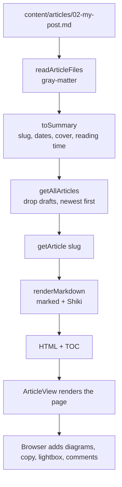

# Articles overview

> **In short:** Each article is a markdown file in `content/articles/`. At build time `src/lib/posts.ts` reads the files, and `src/lib/markdown.ts` turns them into HTML. The browser then adds the interactive parts (diagrams, copy buttons, comments).

## Files involved

| File                                | What it does                                                            |
| ----------------------------------- | ----------------------------------------------------------------------- |
| `content/articles/NN-slug.md`       | The articles. `NN` only sets the file order.                            |
| `src/lib/posts.ts`                  | Reads files, parses frontmatter, builds summaries, finds related posts. |
| `src/lib/markdown.ts`               | Markdown to HTML: extensions, Shiki code colours, heading ids, TOC.     |
| `src/lib/articleSchema.ts`          | The frontmatter type (`ArticleFrontmatter`).                            |
| `src/utils/articleDate.ts`          | Parses and checks `YYYY-MM-DD` dates.                                   |
| `src/utils/generateArticleCover.ts` | Cover paths and cover colours for a slug.                               |

## From file to page

1. **Read.** `readArticleFiles()` reads every `.md` (and `.mdx`, handled the same way) in `content/articles/`. `gray-matter` splits the frontmatter from the body.
2. **Slug.** The file name minus the extension and the `NN-` prefix. `02-how-git-cherry-pick.md` becomes `/articles/how-git-cherry-pick`.
3. **Summary.** `toSummary()` fills in defaults:
    - title falls back to the slug, description to empty text
    - dates are normalised to `YYYY-MM-DD`
    - no `cover` means a generated cover at `/images/articles/generated/<slug>.svg`
    - reading time is words divided by 200, at least 1 minute
4. **Check.** For published posts, a bad `date` or `updated` stops the build with a clear error.
5. **Filter and sort.** Drafts (`draft: true`) are removed. The rest are sorted newest first by `date`.
6. **Render.** `renderMarkdown()` builds the HTML and the table of contents. See [Article markdown](Article-Markdown.md).
7. **Show.** The route renders `ArticleView`. See [Article page](Article-Page.md).

## What runs where

| At build time                     | In the browser                      |
| --------------------------------- | ----------------------------------- |
| Reading files and frontmatter     | Mermaid and flow diagrams           |
| Shiki code highlighting           | Code copy buttons                   |
| Gist embeds (fetched once)        | Image lightbox                      |
| Heading ids and TOC               | TOC scroll spy and reading progress |
| Covers, OG images, feeds, sitemap | Search, tag filter, pagination      |
|                                   | Share menu and giscus comments      |

## Helpers in `posts.ts`

| Function                | Used by                                                               |
| ----------------------- | --------------------------------------------------------------------- |
| `getAllArticles()`      | Listing, search, feeds, sitemap, home teaser, scripts.                |
| `getArticle(slug)`      | Article page, feeds. Returns `null` for drafts.                       |
| `getLatestArticles(n)`  | Home "Latest Articles".                                               |
| `getAllTags()`          | Tag filter.                                                           |
| `getRelatedArticles()`  | Related list. Score: shared tag x3, same category +4, same series +5. |
| `getSeriesForArticle()` | Series tracker (needs 2 or more published parts).                     |
| `getAdjacentArticles()` | Previous and next links.                                              |
| `hasArticles()`         | Navbar hides "Articles" when there are none.                          |

## Adding an article

1. Create `content/articles/NN-my-slug.md` with the next number.
2. Fill in the frontmatter. See [Article markdown](Article-Markdown.md).
3. Or use the dev only editor at `/studio/article-editor`. See [Article editor studio](Article-Editor-Studio.md).
4. Run `pnpm gen:covers` and `pnpm build`.
5. Read the writing rules in `CLAUDE.md`: articles are true first person stories with story specific headings.

## Good to know

- **The parse cache is production only.** In dev, files are re-read on every request, so edits show up at once.
- **Same date, random order.** Two posts with the same `date` have no tie breaker. That affects the pager and the home teaser.
- **Raw HTML is allowed** in markdown and is not sanitised, because all content is first party.

## Related pages

- [Article markdown](Article-Markdown.md)
- [Article page](Article-Page.md)
- [Article listing and search](Article-Listing-and-Search.md)
- [Covers and OG images](Covers-and-OG-Images.md)
