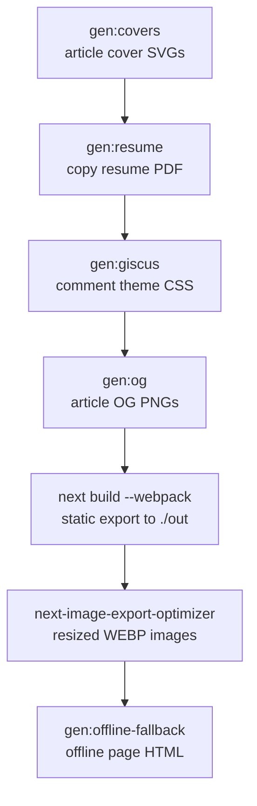
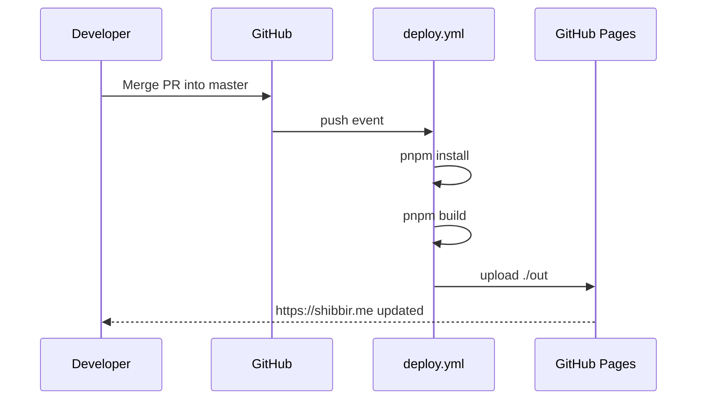

# Build and deploy

> **In short:** `pnpm build` turns the whole site into static files in `./out`. On every push to `master`, GitHub Actions builds the site and publishes `./out` to GitHub Pages at `https://shibbir.me`.

## Files involved

| File                                 | What it does                                                     |
| ------------------------------------ | ---------------------------------------------------------------- |
| `package.json`                       | The `build` script and the order of its steps.                   |
| `next.config.ts`                     | Static export, image settings, build time stamp, service worker. |
| `.github/workflows/deploy.yml`       | Builds and deploys the site to GitHub Pages.                     |
| `.github/workflows/publish-wiki.yml` | Publishes `docs/wiki/` to the GitHub wiki.                       |
| `public/CNAME`                       | Tells GitHub Pages to use the `shibbir.me` domain.               |

## What `pnpm build` does

1. **Generate assets.** Covers, the resume PDF, and comment themes are written into `public/`.
2. **Generate OG images.** One PNG per article for social cards, into `public/og/`.
3. **Next.js build.** Every route is rendered to HTML once. The service worker is compiled here too.
4. **Optimize images.** Resized WEBP copies and blur placeholders go into `out/`.
5. **Offline page.** A small HTML page is built for when a visitor is offline.

## Static export, in plain words

`next.config.ts` sets `output: 'export'` in production. That means there is **no server** on the live site. Every page is a ready made HTML file.

Because of that, these Next.js features are **not allowed** in production code:

- API routes and Server Actions
- Middleware
- ISR or any dynamic rendering
- The default `next/image` optimizer (a custom loader is used instead)

Routes like `sitemap.ts`, `robots.ts`, and the feeds use `export const dynamic = 'force-static'` so Next.js renders them once at build time.

## The dev only file trick

`next.config.ts` changes `pageExtensions` by mode:

- In dev, files ending in `.dev.tsx` and `.dev.ts` are routes too.
- In production, they are ignored.

This is how the [Article editor studio](Article-Editor-Studio.md) uses server features in dev but never ships.

## Deploy to GitHub Pages

- The job uses Node 22 and pnpm 10.
- `.next/cache` is cached between runs to speed up builds.
- Only one deploy runs at a time. A running deploy is never cancelled.
- You can also start it by hand from the Actions tab.

Before a merge, `.github/workflows/ci.yml` runs every check on the pull request (lint, types, tests, build checks, browser tests, Lighthouse). See [Testing](Testing.md).

The wiki is published by a separate workflow. See [Wiki guide](Wiki-Guide.md).

## Good to know

- **Build time stamp.** Each build sets `NEXT_PUBLIC_BUILD_TIME` to the current time. The site uses it to spot a newer deploy. See [App updates](App-Updates.md).
- **`PAGES_BASE_PATH` is not used.** The site is served at the domain root, so no `basePath` is needed. If it ever moves to a sub path, wire `basePath` and `assetPrefix` in `next.config.ts`.
- **Generated files are git ignored**: `public/og/`, `public/sw.js`, `public/giscus-*.css`, generated covers, and the resume PDF.

## Related pages

- [Getting started](Getting-Started.md)
- [Configuration](Configuration.md)
- [Local preview](Local-Preview.md)
- [PWA and offline](PWA-and-Offline.md)
