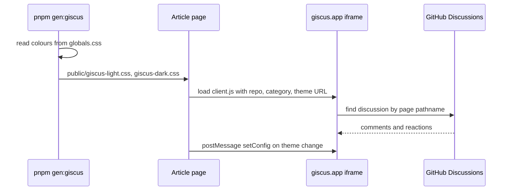

# Comments

> **In short:** Article comments use giscus, which stores them in GitHub Discussions of this repo. The widget matches the site theme using two CSS files that a script generates from `globals.css`.

## Files involved

| File                                                        | What it does                                                        |
| ----------------------------------------------------------- | ------------------------------------------------------------------- |
| `src/components/pages/articles/Comments/index.tsx`          | The comments section at the end of an article.                      |
| `src/components/pages/articles/Comments/hooks/useGiscus.ts` | Injects the giscus script and syncs the theme.                      |
| `src/config/constants.ts`                                   | `giscusRepo`, `giscusRepoId`, `giscusCategory`, `giscusCategoryId`. |
| `scripts/generate-giscus-themes.ts`                         | Writes `public/giscus-light.css` and `public/giscus-dark.css`.      |
| `openspec/specs/article-comments/spec.md`                   | The rules for this feature.                                         |

## How it works

1. `gen:giscus` (part of `dev` and `build`) reads `--background`, `--foreground`, and `--section-swell-teal` from the light and dark blocks in `globals.css`. It stops with an error if one is missing.
2. It writes two theme files into `public/`. They are git ignored.
3. On the article page, `useGiscus` adds `https://giscus.app/client.js` with:
    - the repo and category from `constants.ts`
    - `data-mapping="pathname"`, so each article URL gets its own discussion
    - lazy loading, reactions on, input box at the bottom
    - a theme URL of `<origin>/giscus-light.css` or `giscus-dark.css`
4. When the site theme changes, it sends a `setConfig` message to the iframe so the comments switch too.

## How to change it

- **Different repo or category:** create new IDs at https://giscus.app and update the four `giscus*` constants.
- **Different look:** edit `scripts/generate-giscus-themes.ts`, then run `pnpm gen:giscus`.

## Good to know

- **The custom theme only loads over HTTPS.** giscus fetches the CSS from your origin, so use production or `pnpm dev:https` to see it.
- Discussions must be on for the repo and the giscus GitHub App must be installed, or the widget shows a setup error.

## Related pages

- [Article page](Article-Page.md)
- [Theme system](Theme-System.md)
