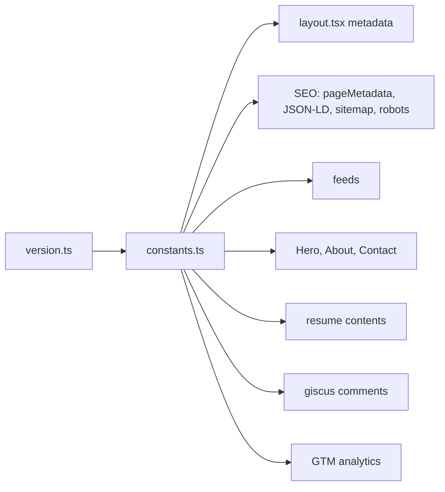

# Configuration

> **In short:** Personal data, URLs, and public keys live in `src/config/constants.ts`. Build behaviour lives in `next.config.ts`. There are no `.env` files: only `NODE_ENV` and an optional `NEXT_PUBLIC_BUILD_TIME` matter.

## Files involved

| File                                 | What it does                                                        |
| ------------------------------------ | ------------------------------------------------------------------- |
| `src/config/constants.ts`            | The single source of truth for site content and IDs.                |
| `src/config/env.ts`                  | `isProduction` and `isDevelopment` flags.                           |
| `src/config/fonts.ts`, `monoFont.ts` | Font setup. See [Root layout](Root-Layout.md).                      |
| `src/lib/version.ts`                 | `getBuiltAt()`: the build time stamp.                               |
| `next.config.ts`                     | Static export, dev only routes, images, build time, service worker. |

## Who reads `constants.ts`

## What is in `constants.ts`

| Group     | Examples                                                                      |
| --------- | ----------------------------------------------------------------------------- |
| Site      | `siteURL`, `siteName`, `siteDescription`, `siteKeywords`, `siteLocale`        |
| Person    | `personGivenName`, `personFamilyName`, `professionalTitle`, `siteAuthorEmail` |
| Images    | `siteThumbnail`, `resumeThumbnail`, `defaultThumbnail`                        |
| Work      | `currentJobTitle`, `currentWorkplace`, `careerExperience`                     |
| Education | `education`, `educationURL`, `addressCountry`                                 |
| Social    | `linkedInURL`, `githubURL`, `facebookURL`, `twitterURL`                       |
| Services  | `googleTagManagerId`, `giscus*`, `web3formsAccessKey`, `hcaptchaSiteKey`      |
| JSON-LD   | `siteDatePublished`, `jsonLdKnowsAbout`, `jsonLdDescription`                  |

**`careerExperience`** is the build year minus 2019. It uses the build time, not `new Date()`, so the browser and the prebuilt HTML always agree.

## Environment values

| Name                         | Set by           | Used for                                                                    |
| ---------------------------- | ---------------- | --------------------------------------------------------------------------- |
| `NODE_ENV`                   | Next.js          | Static export, dev only routes, service worker, production only parts.      |
| `NEXT_PUBLIC_BUILD_TIME`     | `next.config.ts` | Update check, sitemap dates, JSON-LD dates. Set it yourself to pin a build. |
| `PAGES_BASE_PATH`            | `deploy.yml`     | Passed in CI but **not used**.                                              |
| `nextImageExportOptimizer_*` | `next.config.ts` | Image optimizer: WEBP, quality 75, blur placeholders.                       |

## `next.config.ts` in short

- `output: 'export'` in production only.
- `pageExtensions` adds `dev.tsx` and `dev.ts` in dev only.
- `images.loader: 'custom'` for `next-image-export-optimizer`, with small sizes (the main image is a 224px headshot).
- `withSerwist(...)` builds the service worker. See [PWA and offline](PWA-and-Offline.md).

## Good to know

- **Edit `constants.ts` first** for any content change. Do not hard code names or links in components.
- **The keys here are public.** Web3Forms and hCaptcha keys are meant to be in the browser. Never put a secret in this file, since the whole site is public.
- Use `isDevelopment` from `env.ts` for dev only UI, so the bundler removes it from production.

## Related pages

- [Build and deploy](Build-and-Deploy.md)
- [SEO and structured data](SEO-and-Structured-Data.md)
- [Project structure](Project-Structure.md)
