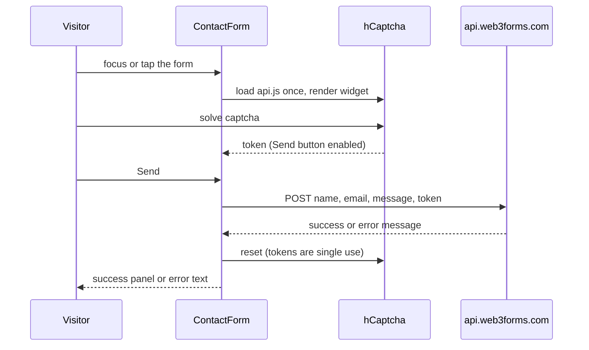

# Contact form

> **In short:** The home page contact form sends messages through Web3Forms, straight from the browser. hCaptcha protects it and only loads after the visitor first touches the form, to keep the page fast.

## Files involved

All paths are under `src/components/pages/home/ContactArea/` unless noted.

| File                                     | What it does                                                |
| ---------------------------------------- | ----------------------------------------------------------- |
| `index.tsx`                              | The section: `ContactForm` then `SocialIcons`.              |
| `ContactForm.tsx`                        | The panel: aside on the left, form or success on the right. |
| `ContactAside.tsx`, `StatusDot.tsx`      | Headline, text, reply time, and a mailto link.              |
| `contents.ts`, `types.ts`                | The field definitions.                                      |
| `CaptchaSlot.tsx`                        | Reserves space for the captcha and shows a placeholder.     |
| `captchaHint.ts`                         | Picks the hint text under the form.                         |
| `ContactSuccess.tsx`                     | "Message sent" state with "Send another".                   |
| `hooks/useFirstInteraction.ts`           | Turns true on the first focus, tap, or hover.               |
| `hooks/useHCaptcha.ts`                   | Loads and renders hCaptcha. Follows the theme.              |
| `hooks/useContactForm.ts`                | Form values, status, and submit.                            |
| `src/lib/contact/index.ts`               | `contactProvider`: the Web3Forms provider.                  |
| `src/lib/contact/providers/web3forms.ts` | Sends the POST request.                                     |
| `src/lib/contact/types.ts`               | The provider contract, so it can be swapped.                |

## How it works

1. **Fields:** name, email, and message. All are `required`. Checks are native HTML only (`required`, `type="email"`).
2. **Lazy captcha:** `useFirstInteraction` flips on the first focus or pointer down in the form (or hover on the slot). Then `useHCaptcha` injects `https://js.hcaptcha.com/1/api.js?render=explicit` one time.
3. **Theme:** the widget uses `useResolvedTheme`. When the theme changes, it is removed and drawn again.
4. **Send:** the button stays disabled until there is a captcha token.
5. **Submit:** `useContactForm` calls `contactProvider.submit(...)`. The Web3Forms provider posts JSON with the access key, fields, a subject line, and `h-captcha-response`.
6. **Result:** success shows `ContactSuccess`. Errors show in a `role="alert"` line. The captcha always resets.

## How to change it

- **Keys:** `web3formsAccessKey` and `hcaptchaSiteKey` in `src/config/constants.ts`. They are public keys, meant to ship to the browser.
- **Fields:** edit `contents.ts`, and add the field to the provider payload.
- **Another email service:** write a new provider in `src/lib/contact/providers/` that matches `ContactProvider`, and use it in `src/lib/contact/index.ts`.

## Good to know

- **No server needed.** The site is static, so the browser talks to Web3Forms directly.
- **Never bypass the captcha.** It is a project rule.
- The panel uses an emerald accent bloom that matches the green success state.

## Related pages

- [Home page](Home-Page.md)
- [Theme system](Theme-System.md)
- [Configuration](Configuration.md)
