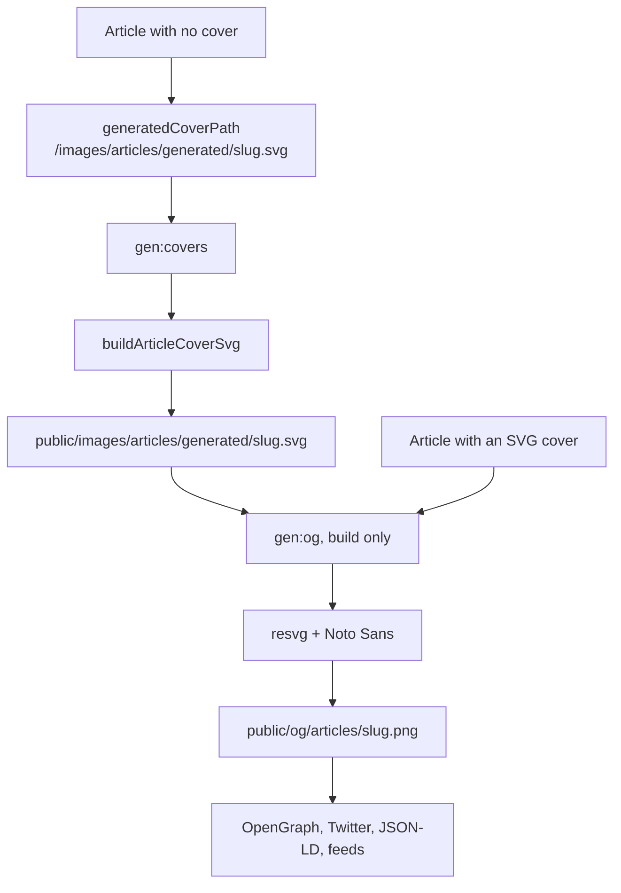

# Covers and OG images

> **In short:** An article without a `cover` gets a generated SVG cover (gradient + title). At build time each SVG cover is also turned into a 1200x630 PNG for social cards, because social sites do not accept SVG.

## Files involved

| File                                | What it does                                                  |
| ----------------------------------- | ------------------------------------------------------------- |
| `src/utils/generateArticleCover.ts` | Builds the cover SVG. Also gives cover paths and colours.     |
| `scripts/generate-covers.ts`        | `pnpm gen:covers`: writes missing covers, removes stale ones. |
| `scripts/generate-og-images.ts`     | `pnpm gen:og`: turns SVG covers into PNGs with resvg.         |
| `scripts/assets/fonts/`             | Noto Sans fonts used when drawing the PNGs.                   |
| `src/app/opengraph-image.png`       | The site wide OG image for the home page.                     |
| `public/images/og-*.png`            | OG images for the resume and other pages.                     |

## How it works

## What a generated cover looks like

- Size 1200x630.
- A diagonal gradient. The colour pair is picked from 30 pairs by a hash of the slug, so the same slug always gets the same colours.
- A soft white glow and a light dark overlay.
- The first tag in capitals as a small label.
- The title, wrapped to fit (font size shrinks from 62 to 38, up to 6 lines).
- "shibbir.me" at the bottom.

## Cover colours

Every article has two cover colours (`coverColors`). They tint the card glow, the page background, the reading bar, and the TOC.

- Generated cover: the gradient pair from the slug.
- Your own SVG cover: the first two `stop-color` values in the file.
- Anything else: the slug based pair.

## When they run

| Script       | `pnpm dev` | `pnpm build` |
| ------------ | ---------- | ------------ |
| `gen:covers` | Yes        | Yes          |
| `gen:og`     | No         | Yes          |

## How to change it

- **Use your own cover:** put an image in `public/images/...` and set `cover: '/images/...'` in the frontmatter.
- **Change the design:** edit `buildArticleCoverSvg` in `generateArticleCover.ts`, then run `pnpm gen:covers`.
- **Other page OG images:** `buildPageMetadata` uses `defaultThumbnail` unless you pass `image`. See [SEO and structured data](SEO-and-Structured-Data.md).

## Good to know

- **Generated files are git ignored**: `public/images/articles/generated/` and `public/og/`.
- **Both scripts clean up.** Covers and PNGs for deleted articles are removed.
- **Raster covers** (JPG or PNG) are used as the OG image as is.

## Related pages

- [Articles overview](Articles-Overview.md)
- [Build and deploy](Build-and-Deploy.md)
