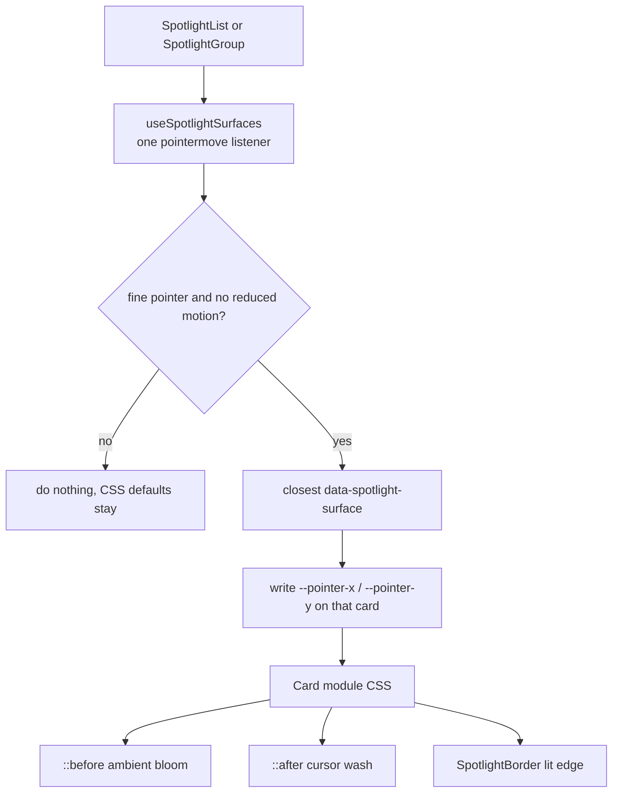

# Design system

> **In short:** Tailwind CSS v4 utilities are the default. Custom CSS goes in a CSS Module beside its component. Every card and panel gets the "accent bloom": a soft glow that rests dim and grows on hover, plus a cursor spotlight.

## Files involved

| File                                                             | What it does                                                        |
| ---------------------------------------------------------------- | ------------------------------------------------------------------- |
| `src/app/globals.css`                                            | Global only: tokens, base styles, shared keyframes and utilities.   |
| `postcss.config.mjs`                                             | Loads the Tailwind PostCSS plugin.                                  |
| `src/utils/cn.ts`                                                | `cn()`: `clsx` plus `tailwind-merge`.                               |
| `src/components/ui/`                                             | `Button`, `ButtonLink`, `Input`, `Textarea`, `Checkbox`, `Spinner`. |
| `src/components/pages/common/`                                   | `SectionHeading`, `Tag`, `TagGroup`, spotlight helpers.             |
| `src/components/pages/common/spotlightSurface.ts`                | `spotlightSurfaceProps`: marks an element as a surface.             |
| `src/components/pages/common/hooks/useSpotlightSurfaces.ts`      | One pointer listener that feeds all surfaces in a group.            |
| `SpotlightList.tsx`, `SpotlightGroup.tsx`, `SpotlightBorder.tsx` | Group wrappers and the lit edge.                                    |

## Styling rules

- **No `tailwind.config.js`.** Configuration is CSS first, with `@theme` and `@utility` in `globals.css`.
- **Component CSS goes in a module**, like `SkillCard/SkillCard.module.css`, imported with `@/`.
- **Inside a module, use `@apply`** for anything Tailwind can express, including arbitrary properties like `@apply [-webkit-user-drag:none]`. Add `@reference "tailwindcss";` at the top.
- **Raw CSS only for** `color-mix()`, gradients, `@keyframes`, and custom properties.
- **Use `motion-safe:`** on every animation.
- **Never put component rules in `globals.css`.**

## The accent bloom and spotlight

Each card module has three layers:

1. **`::before`: ambient bloom.** A `radial-gradient` with `color-mix(in oklab, <accent> var(--glow), transparent)`. It rests dim (for example `opacity-55`) and goes to `opacity-100` on `:hover`, with a slow `motion-safe` fade.
2. **`::after`: cursor wash.** A soft circle centred at `--pointer-x` and `--pointer-y`.
3. **`SpotlightBorder`:** a real `` border, masked so only the edge near the cursor lights up.

**Glow strength** is a custom property, about `9%` in light and `16%` in dark, set with the paired dark selectors (see [Theme system](Theme-System.md)).

**Accent colour** comes from context: a skill's brand colour (`--brand-color`), a golden angle hue per card index (projects, now, uses), the cover colours (articles), or emerald (contact).

Reference modules: `SkillsArea/SkillCard`, `ProjectsArea/ProjectCard`, `ContactArea/ContactForm.module.css`, `Footer/SignatureSpotlight`.

## Adding a new card

1. Spread `spotlightSurfaceProps` on the card root. Make it `relative isolate`.
2. Put the card inside a `SpotlightList` (for `<ul>`) or `SpotlightGroup` (for `
`).
3. Create `MyCard.module.css` with the `::before` bloom, `::after` wash, and dark mode strength.
4. Add a `<SpotlightBorder />` inside the card.

## Good to know

- **Touch devices and reduced motion** skip pointer tracking. Cards keep the centred defaults.
- The hook never sets opacity. Modules handle fades with `:hover`.
- Always compose classes with `cn()`, so later classes override earlier ones cleanly.

## Related pages

- [Theme system](Theme-System.md)
- [Page backgrounds](Page-Backgrounds.md)
- [Project structure](Project-Structure.md)
