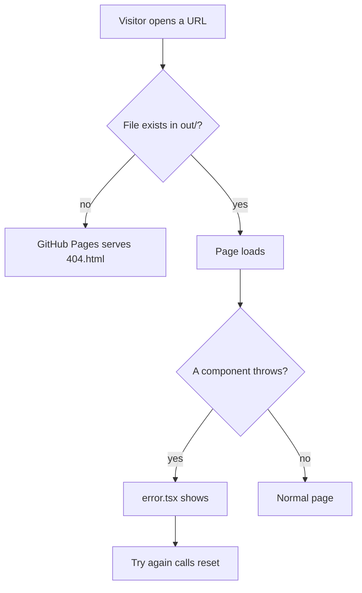

# Error pages

> **In short:** `not-found.tsx` becomes `404.html`, which GitHub Pages serves for any unknown URL. `error.tsx` catches runtime errors in the browser and offers "Try again".

## Files involved

| File                                 | What it does                                           |
| ------------------------------------ | ------------------------------------------------------ |
| `src/app/not-found.tsx`              | The 404 page. Exported to `out/404.html`.              |
| `src/app/error.tsx`                  | Client error boundary for crashes while the page runs. |
| `openspec/specs/error-pages/spec.md` | The rules both pages follow.                           |

## How it works

## The 404 page

- Big "404", the heading "This page wandered off", and a short line of text.
- Two buttons: **Back home** (`/`) and **Read articles** (`/articles`).
- It renders inside the root layout, so the navbar and footer are there.

## The error page

- Shows "Something went wrong" on a faded grid background.
- **Try again** calls Next.js `reset()`, which re-renders the broken part.
- **Back home** links to `/`.
- It does not log or report the error anywhere.

## Good to know

- Both pages use the shared `SectionHeading`, `Button`, and `ButtonLink` components.
- A page that is missing **while offline** shows the offline page instead. See [Offline page](Offline-Page.md).
- The local preview servers also return `404.html` for unknown paths, so you can test it with `pnpm preview`.

## Related pages

- [Offline page](Offline-Page.md)
- [Local preview](Local-Preview.md)
