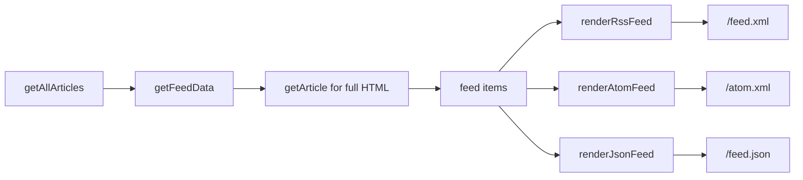

# Feeds

> **In short:** Three feeds are built at build time: RSS at `/feed.xml`, Atom at `/atom.xml`, and JSON Feed at `/feed.json`. They all use the same data from `src/lib/feed.ts` and include the full article HTML.

## Files involved

| File                                   | What it does                                             |
| -------------------------------------- | -------------------------------------------------------- |
| `src/lib/feed.ts`                      | `getFeedData()` plus the three renderers.                |
| `src/app/feed.xml/route.ts`            | RSS 2.0 (`application/rss+xml`).                         |
| `src/app/atom.xml/route.ts`            | Atom (`application/atom+xml`).                           |
| `src/app/feed.json/route.ts`           | JSON Feed 1.1 (`application/feed+json`).                 |
| `src/app/layout.tsx`                   | Advertises all three in `<head>` via `alternates.types`. |
| `openspec/specs/article-feeds/spec.md` | The rules for this feature.                              |

## How it works

1. `getFeedData()` takes all published articles and loads each one's full HTML.
2. Each item has: title, description, absolute URL, image, tags, published and updated dates, and the HTML body.
3. The feed's own "updated" time is the newest item's update, or the build time if there are no articles.
4. Each route calls its renderer and returns the text with the right content type.
5. Each route sets `export const dynamic = 'force-static'`, so it becomes a plain file in `out/`.

## What each feed contains

| Feed | Channel info                               | Per item                                                               |
| ---- | ------------------------------------------ | ---------------------------------------------------------------------- |
| RSS  | title, link, description, language, editor | title, link, guid, pubDate, description, categories, `content:encoded` |
| Atom | id, title, subtitle, updated, author       | id, title, link, published, updated, summary, categories, content      |
| JSON | title, home page, feed URL, authors        | id, url, title, summary, `content_html`, image, dates, tags            |

## Good to know

- **Images:** SVG covers are swapped for the PNG from `/og/articles/<slug>.png`, since feed readers handle PNG better.
- **Drafts are never in feeds**, because `getAllArticles()` removes them.
- **Channel info** comes from `siteURL`, `siteName`, `siteDescription`, `siteAuthor`, and `siteAuthorEmail` in `constants.ts`.

## Related pages

- [Articles overview](Articles-Overview.md)
- [Covers and OG images](Covers-and-OG-Images.md)
- [SEO and structured data](SEO-and-Structured-Data.md)
