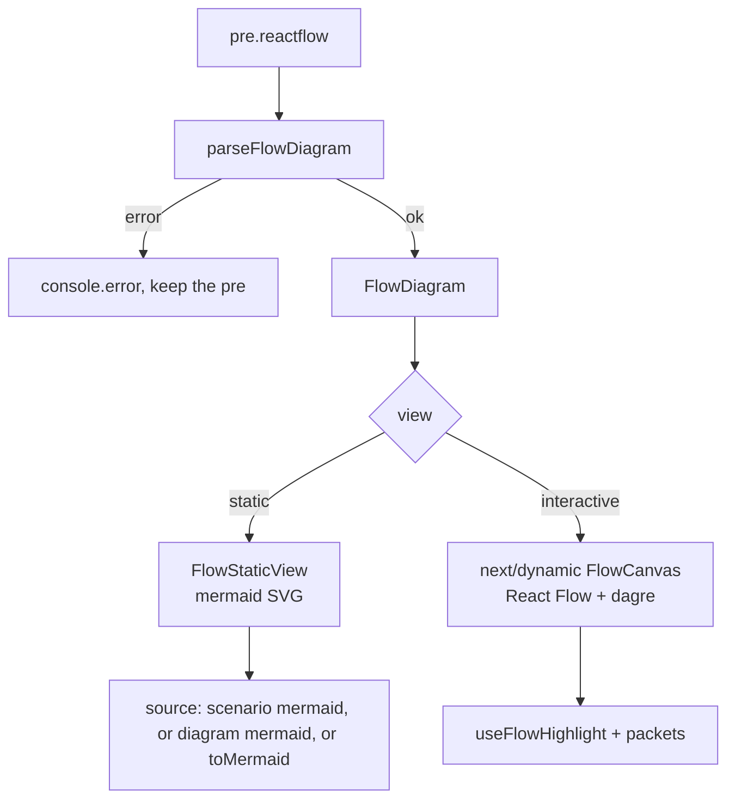

# Flow diagrams

> **In short:** A ` ```reactflow ` block uses a small custom syntax to describe nodes, hops, and scenarios. The browser shows it as a static mermaid picture by default, and readers can switch to an interactive React Flow canvas with moving "packets" and step by step captions.

## Files involved

All paths are under `src/components/pages/articles/FlowDiagram/`.

| File                                                                             | What it does                                                            |
| -------------------------------------------------------------------------------- | ----------------------------------------------------------------------- |
| `index.tsx` + `hooks/useFlowDiagramIslands.ts`                                   | Finds `pre.reactflow` blocks, parses them, portals a diagram into each. |
| `parseFlowDiagram.ts`, `types.ts`                                                | The syntax parser and its types.                                        |
| `FlowDiagram.tsx`                                                                | Owns the state: view, scenario, selected node, playback.                |
| `FlowControls.tsx`                                                               | View switch, scenario switch, playback buttons.                         |
| `FlowStaticView.tsx`                                                             | Static view: renders mermaid (reuses the mermaid parts).                |
| `FlowInteractiveView.tsx`                                                        | Lazy loads `FlowCanvas` only when the reader switches.                  |
| `FlowCanvas.tsx`, `FlowNode.tsx`, `FlowPacketEdge.tsx`                           | The React Flow canvas, nodes, and animated edges.                       |
| `layout.ts`, `hooks/useFlowNodeLayout.ts`                                        | Auto layout with dagre, left to right.                                  |
| `hooks/useFlowHighlight.ts`                                                      | Which nodes and edges are active or dimmed.                             |
| `hooks/useFlowPlayback.ts`, `hooks/useSmilPlayback.ts`, `hooks/useInViewport.ts` | Playback state and when the animation clock runs.                       |
| `toMermaid.ts`, `captions.ts`                                                    | Mermaid conversion and caption text.                                    |

## The syntax

```text
title: How a phone reaches Pi-hole
packets: on
default: static

scenario "Router-wide"
> Shown as the caption for this scenario.

Router [hands out 192.168.0.20]
> Description shown when the node is clicked.

Ad blocked [nothing here] {blocked}

Phone --> Router
Router --> Pi-hole (all DNS)
Pi-hole --> Ad blocked (ad domain) {blocked}
> Caption shown for this hop when stepping.

mermaid:
    flowchart LR
        Phone --> Router
```

- `Name [detail] {tone}` declares a node. The id is the slugified name.
- `A --> B (label) {tone}` declares a hop. Nodes are created automatically.
- Tones: `neutral`, `secure`, `blocked`, `allowed`.
- `> text` adds prose to whatever is right above it.
- `mermaid:` (optional) gives a hand written mermaid picture for the static view.
- At least one `scenario` is needed. Real examples are in articles `02` and `03`.

## How it works



1. The island hook parses each block. A block with a syntax error stays as plain text and logs to the console.
2. **Static view** (the default) shows mermaid. It uses the scenario's `mermaid:`, then the diagram's `mermaid:`, and otherwise `toMermaid()` builds one.
3. **Interactive view** loads React Flow and dagre on demand. dagre lays out all scenarios together, so nodes do not jump when you change scenario.
4. **Packets** are small dots that move along edges with SVG `<animateMotion>`. They loop, or play one hop at a time when stepping.
5. **Captions** show, by priority: the current hop while stepping, then the clicked node, then the scenario summary.

## Good to know

- **The animation only runs when visible.** `useInViewport` and `useSmilPlayback` pause the SVG clock when the diagram is off screen or in the static view.
- **Reduced motion.** Playback switches to manual steps, the play button hides, and packets stay still.
- **Touch.** Inline canvases let a thumb scroll the page (`useBlockTouchPan`). The full view allows touch pan.
- **Copy** always copies mermaid, not the `reactflow` text.
- **Tone colours** in `diagramTones.ts` must be kept in step by hand with the `--tone-*` variables in `FlowDiagram.module.css`.
- **No build check.** Syntax errors are only visible in the browser console. Always look at the rendered page.

## Related pages

- [Mermaid diagrams](Mermaid-Diagrams.md)
- [Article markdown](Article-Markdown.md)
