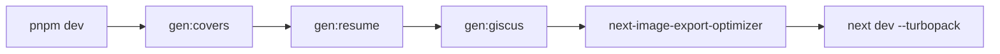

# Getting started

> **In short:** Install pnpm, run `pnpm install`, then `pnpm dev`. The site opens at `http://localhost:3000`.

## What you need

| Tool    | Version | Why                                                                               |
| ------- | ------- | --------------------------------------------------------------------------------- |
| Node.js | 22+     | CI builds with Node 22. `.nvmrc` pins 24 for local work, which also works.        |
| pnpm    | 10      | The only package manager used. The lock file is `pnpm-lock.yaml`.                 |
| Docker  | any     | Optional. Only for `pnpm preview:docker` (see [Local preview](Local-Preview.md)). |

## First run

```bash
pnpm install
pnpm dev
```

`pnpm dev` does more than start Next.js. It first makes the files the site needs:



1. `gen:covers` draws a cover SVG for any article with no `cover` set.
2. `gen:resume` copies a private resume PDF into `public/`, if one exists.
3. `gen:giscus` builds the comment widget theme CSS from `globals.css`.
4. `next-image-export-optimizer` makes resized WEBP copies of images in `public/images/`.
5. Next.js starts with Turbopack.

## All commands

| Command               | What it does                                                          |
| --------------------- | --------------------------------------------------------------------- |
| `pnpm dev`            | Local dev server with hot reload.                                     |
| `pnpm dev:https`      | Same, over HTTPS. Use it to test PWA and share features.              |
| `pnpm build`          | Full production build. Output goes to `./out`.                        |
| `pnpm preview`        | Serve `./out` at `http://localhost:4321`.                             |
| `pnpm preview:https`  | Serve `./out` over HTTPS at `https://localhost:4322`.                 |
| `pnpm preview:docker` | Serve `./out` with nginx in Docker, with a trusted local certificate. |
| `pnpm lint`           | ESLint check.                                                         |
| `pnpm typecheck`      | TypeScript check of the whole project, tests included.                |
| `pnpm test`           | Unit and component tests. See [Testing](Testing.md).                  |
| `pnpm test:build`     | Checks on the built `./out` (run `pnpm build` first).                 |
| `pnpm test:e2e`       | Browser tests on four screen sizes (run `pnpm build` first).          |
| `pnpm test:ci`        | Everything CI runs, in the same order.                                |
| `pnpm format`         | Prettier writes fixes to every file.                                  |
| `pnpm format:check`   | Prettier checks only.                                                 |
| `pnpm gen:covers`     | Only regenerate article covers.                                       |
| `pnpm gen:og`         | Only regenerate article OpenGraph PNGs.                               |
| `pnpm gen:resume`     | Only copy the resume PDF.                                             |
| `pnpm gen:giscus`     | Only regenerate comment theme CSS.                                    |

## Dev mode vs production

Some things only run in one mode. This surprises people, so remember it:

| Feature                           | `pnpm dev` | `pnpm build` |
| --------------------------------- | ---------- | ------------ |
| Article editor studio (`/studio`) | Yes        | No           |
| Navbar "Studio" menu              | Yes        | No           |
| Service worker and update toast   | No         | Yes          |
| Google Tag Manager and pageviews  | No         | Yes          |
| JSON-LD structured data           | No         | Yes          |
| Static export to `./out`          | No         | Yes          |

To check a production only feature, run `pnpm build` and then `pnpm preview`.

## Before you open a pull request

- Run `pnpm lint`, `pnpm typecheck`, and `pnpm test`.
- Add or update tests for what you changed. See [Testing](Testing.md).
- Run `pnpm build`, then `pnpm test:build` and `pnpm test:e2e`. CI runs the same checks and blocks the PR if one fails.
- Open the pages you changed in `pnpm dev`, on a phone size screen and a desktop.
- Update the wiki page for the feature you changed.

## Related pages

- [Project structure](Project-Structure.md)
- [Build and deploy](Build-and-Deploy.md)
- [Testing](Testing.md)
- [Tooling](Tooling.md)
