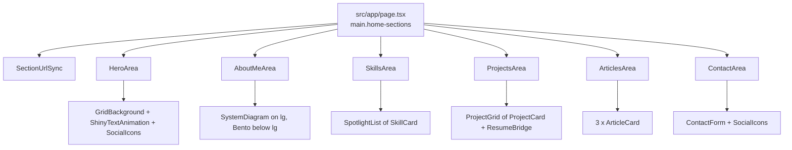

# Home page

> **In short:** `src/app/page.tsx` stacks six sections inside one `<main class="home-sections">`. Each section is a folder under `src/components/pages/home/` with its data in a `contents.ts`.

## Files involved

| Folder under `src/components/pages/home/` | Anchor      | Data file                               |
| ----------------------------------------- | ----------- | --------------------------------------- |
| `HeroArea/`                               | `#hero`     | `HeroArea/contents.ts` (social links)   |
| `AboutMeArea/`                            | `#about`    | `AboutMeArea/contents.ts` (facets)      |
| `SkillsArea/`                             | `#skills`   | `SkillsArea/contents.ts`                |
| `ProjectsArea/`                           | `#work`     | `ProjectsArea/contents.ts`              |
| `ArticlesArea/`                           | `#articles` | Latest posts from `src/lib/posts.ts`    |
| `ContactArea/`                            | `#contact`  | `ContactArea/contents.ts` (form fields) |

## Page order

## Each section

- **Hero.** Full screen. The name (`HeroName`) uses the Zain font and a shine animation over a pulsing grid. Then the job title and social icons. Name and title come from `constants.ts`.
- **About me.** Four "facet" cards around a portrait (`Core`). On large screens, `SystemDiagram` draws connector lines when you scroll to it (`useDrawOnScroll`). On smaller screens, `Bento` shows a 2x2 grid.
- **Skills.** A grid of `SkillCard` tiles. Each skill can set a brand `color`. The icon glows in that colour on hover.
- **Projects** (heading "Open Source"). "Packages & Plugins" shows the first 4 cards, and "Show more" reveals the rest. Then "Personal Projects" and a link to `/resume`. Card glow colours are spread around the colour wheel by index.
- **Articles.** The 3 newest posts as cards and a "View all articles" link. The section is hidden when there are no posts.
- **Contact.** A form with captcha. See [Contact form](Contact-Form.md).

## Section backgrounds

Each `<section>` inside `main.home-sections` is at least one screen tall and has a soft vertical colour swell. The colours cycle indigo, blue, yellow, teal (`nth-of-type` in `globals.css`). The hero is a `
`, so the cycle starts at About. See [Page backgrounds](Page-Backgrounds.md).

## How to change it

- **Edit text or lists:** change the section's `contents.ts`. Keep `index.tsx` thin.
- **Change name, title, links:** edit `src/config/constants.ts`.
- **Add a skill icon:** add an SVG component in `src/components/icons/tech/`, then reference it in `SkillsArea/contents.ts`.
- **Add a section:** create a folder with `index.tsx`, add it to `page.tsx`, add its id to `homeSectionIds` in `Navbar/contents.ts`, and give its surfaces the accent bloom (see [Design system](Design-System.md)).

## Good to know

- Section headings use the shared `SectionHeading` from `src/components/pages/common/`.
- `AnimatedUnderline` and `DotBackground` exist but are not used on any page right now.

## Related pages

- [Contact form](Contact-Form.md)
- [Navigation and scroll](Navigation-and-Scroll.md)
- [Design system](Design-System.md)
