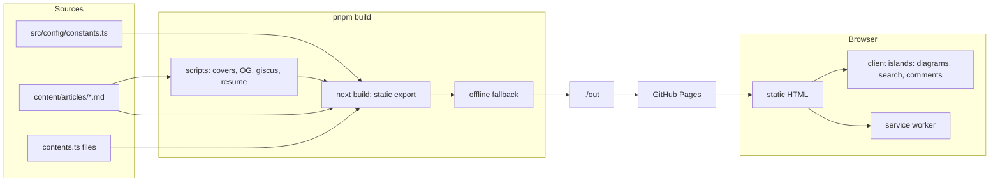

# Developer wiki

> **In short:** This is the personal site and blog of Shibbir Ahmed, live at https://shibbir.me. It is a Next.js 16 app, written in TypeScript with Tailwind CSS v4, built into static files, and hosted on GitHub Pages.

New here? Read [Getting started](Getting-Started.md), then [Project structure](Project-Structure.md).

## The big picture

1. **Content** comes from three places: `constants.ts` (who, links, keys), `contents.ts` files (lists shown on pages), and markdown articles.
2. **The build** runs helper scripts, then Next.js renders every route to HTML in `./out`.
3. **GitHub Pages** serves those files. There is no server.
4. **In the browser**, small React "islands" add the interactive parts, and a service worker makes the site work offline.

## Pages of the site

| URL                                    | What it is                                       | Wiki page                                                   |
| -------------------------------------- | ------------------------------------------------ | ----------------------------------------------------------- |
| `/`                                    | Hero, about, skills, projects, articles, contact | [Home page](Home-Page.md)                                   |
| `/articles`                            | Article list with tags, pages, and search        | [Article listing and search](Article-Listing-and-Search.md) |
| `/articles/<slug>`                     | One article                                      | [Article page](Article-Page.md)                             |
| `/resume`                              | Printable resume                                 | [Resume page](Resume-Page.md)                               |
| `/now`, `/uses`                        | Now and gear pages                               | [Now and uses pages](Now-and-Uses-Pages.md)                 |
| `/network-status`                      | Offline and reconnect page                       | [Offline page](Offline-Page.md)                             |
| `/feed.xml`, `/atom.xml`, `/feed.json` | Article feeds                                    | [Feeds](Feeds.md)                                           |
| `/studio/article-editor`               | Writing tool, dev only                           | [Article editor studio](Article-Editor-Studio.md)           |

## All wiki pages

**Start here**

- [Getting started](Getting-Started.md): install, commands, dev vs production
- [Project structure](Project-Structure.md): folders and import rules
- [Configuration](Configuration.md): constants and environment values
- [Build and deploy](Build-and-Deploy.md): the build steps and GitHub Pages
- [Local preview](Local-Preview.md): test the real export locally
- [Testing](Testing.md): every test suite and the PR checks
- [Tooling](Tooling.md): lint, format, OpenSpec, git rules

**Layout and design**

- [Root layout](Root-Layout.md) · [Theme system](Theme-System.md) · [Navigation and scroll](Navigation-and-Scroll.md)
- [Design system](Design-System.md) · [Page backgrounds](Page-Backgrounds.md)

**Pages**

- [Home page](Home-Page.md) · [Contact form](Contact-Form.md)
- [Resume page](Resume-Page.md) · [Now and uses pages](Now-and-Uses-Pages.md)
- [Error pages](Error-Pages.md)

**Articles**

- [Articles overview](Articles-Overview.md) · [Article markdown](Article-Markdown.md) · [Article page](Article-Page.md)
- [Article listing and search](Article-Listing-and-Search.md)
- [Mermaid diagrams](Mermaid-Diagrams.md) · [Flow diagrams](Flow-Diagrams.md)
- [Comments](Comments.md) · [Feeds](Feeds.md) · [Covers and OG images](Covers-and-OG-Images.md)
- [Article editor studio](Article-Editor-Studio.md)

**Platform**

- [SEO and structured data](SEO-and-Structured-Data.md)
- [PWA and offline](PWA-and-Offline.md) · [App updates](App-Updates.md) · [Offline page](Offline-Page.md)
- [Analytics](Analytics.md)

**About this wiki**

- [Wiki guide](Wiki-Guide.md): page template, size rule, and how it is published
