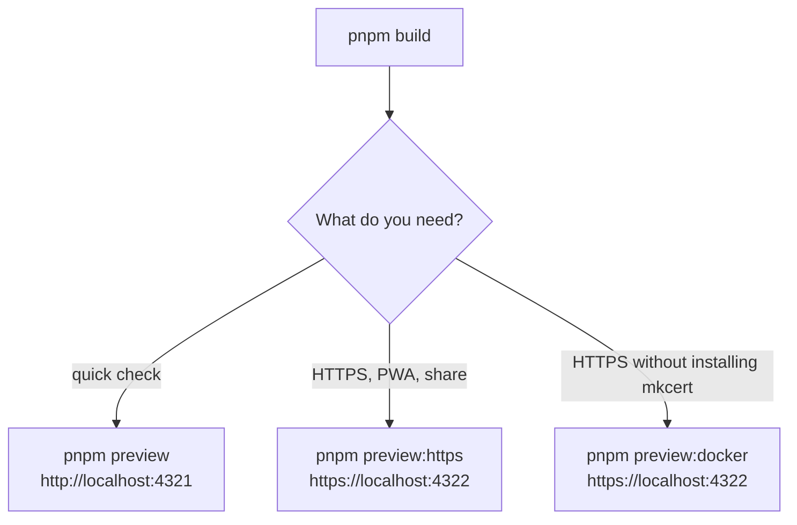

# Local preview

> **In short:** `pnpm dev` hides production only features. To test the real export (service worker, update toast, offline page), run `pnpm build`, then serve `./out` with `pnpm preview`, `pnpm preview:https`, or `pnpm preview:docker`.

## Files involved

| File                      | What it does                                                              |
| ------------------------- | ------------------------------------------------------------------------- |
| `scripts/serve-out.ts`    | A tiny Node server for `./out` that acts like GitHub Pages.               |
| `docker-compose.yml`      | Two services: `trust` (makes and trusts a certificate) and `web` (nginx). |
| `docker/Dockerfile.trust` | Debian image with `mkcert` and `certutil`.                                |
| `docker/trust.sh`         | Creates the localhost certificate and adds the CA to browser stores.      |
| `docker/nginx.conf`       | HTTPS server config that mirrors GitHub Pages routing.                    |
| `certificates/`           | Generated certificates (git ignored).                                     |

## Pick a preview

## `pnpm preview` and `pnpm preview:https`

`scripts/serve-out.ts` serves `./out`:

- For a path with no extension, it tries the file, then `path.html`, then `path/index.html`. A normal static server would 404 here.
- Unknown paths get `out/404.html` with status 404.
- `version.json` is sent with `Cache-Control: no-store`, so update checks work.
- Text files (HTML, JS, CSS, JSON, SVG) are gzipped, like GitHub Pages does, so sizes and Lighthouse scores match production.
- `--port <n>` changes the port.
- With `--https` it makes a trusted certificate using the same `mkcert` flow as `next dev --experimental-https`, saved in `certificates/`.

## `pnpm preview:docker`

1. `trust` runs as your user. It creates the localhost certificate and adds the local CA to Chrome, Chromium, and Firefox trust stores in your home folder.
2. `web` (nginx) starts after `trust` finishes and serves `./out` on port 4322 over HTTPS.
3. Stop it with `pnpm preview:docker:down`.

Nothing is installed on your machine itself.

## Good to know

- **Run `pnpm build` first.** All preview commands exit or show nothing without `./out`.
- **Service workers stick around.** After testing, clear site data in DevTools if you switch back to `pnpm dev`.
- The Docker image downloads the `linux-amd64` mkcert binary. On ARM machines it may need emulation.

## Related pages

- [Getting started](Getting-Started.md)
- [PWA and offline](PWA-and-Offline.md)
- [App updates](App-Updates.md)
