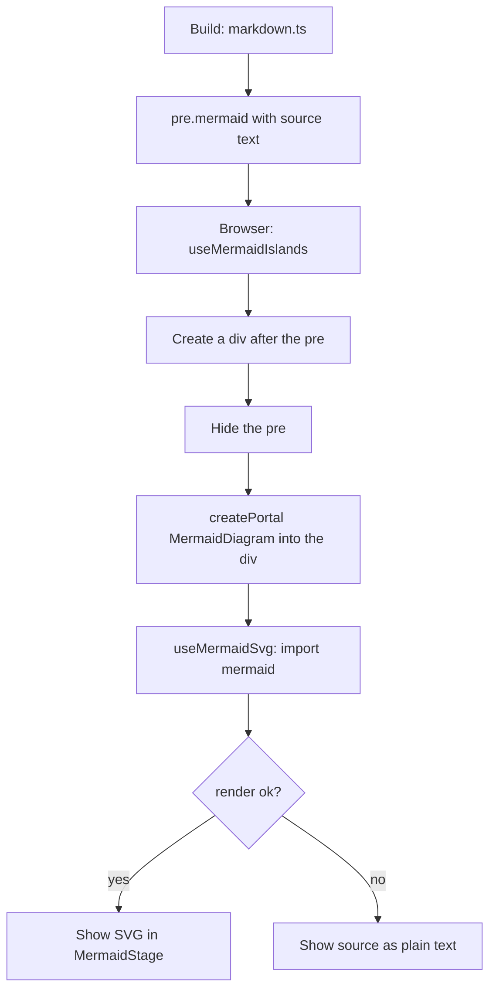

# Mermaid diagrams

> **In short:** A ` ```mermaid ` block is left as plain text in the HTML at build time. In the browser, `MermaidRenderer` finds it, loads the mermaid library only when needed, and replaces it with an SVG you can pan, zoom, copy, and open full screen.

## Files involved

All paths are under `src/components/pages/articles/`.

| File                                         | What it does                                                          |
| -------------------------------------------- | --------------------------------------------------------------------- |
| `src/lib/markdown.ts`                        | Emits `<pre class="mermaid">` with the escaped source.                |
| `MermaidRenderer/index.tsx`                  | Portals one `MermaidDiagram` into each block.                         |
| `MermaidRenderer/hooks/useMermaidIslands.ts` | Finds the blocks and makes a host `<div>` after each.                 |
| `MermaidRenderer/MermaidDiagram.tsx`         | Frame, stage, tools, and the full view modal.                         |
| `MermaidRenderer/hooks/useMermaidSvg.ts`     | Lazy loads mermaid and renders the SVG. Re-renders on theme change.   |
| `MermaidRenderer/mermaidTheme.ts`            | Colours, fonts, spacing for light and dark.                           |
| `MermaidRenderer/MermaidStage.tsx`           | The pan and zoom viewport.                                            |
| `MermaidRenderer/hooks/usePanZoom.ts`        | CSS transform based pan and zoom.                                     |
| `DiagramTools.tsx`, `DiagramModal.tsx`       | Full view and copy buttons, and the modal. Shared with flow diagrams. |
| `hooks/useDiagramViewportKeys.ts`            | Keyboard: arrows pan, `+` `-` zoom, `0` resets.                       |
| `hooks/useModalChrome.ts`                    | Modal scroll lock, focus trap, Escape to close.                       |

## The islands pattern

"Islands" means small React apps mounted inside static HTML.



1. `ArticleView` (and the editor preview) render `<MermaidRenderer />` after the article HTML.
2. On mount, it finds every `pre.mermaid`, adds a host `<div>` after it, and hides the `<pre>`.
3. It portals a `MermaidDiagram` into each host.
4. `useMermaidSvg` runs `await import('mermaid')`, so pages without diagrams never download it.
5. It calls `mermaid.initialize(...)` with the theme for the current light or dark mode, then `mermaid.render(...)`.
6. On unmount, the hosts are removed and the `<pre>` blocks are shown again.

## Features

- **Theme sync.** `useMermaidSvg` subscribes to theme changes (same tab, other tabs, and OS) and renders again with the new colours.
- **Pan and zoom.** Drag with a mouse. Buttons zoom by 1.3x. Scale stays between 0.2 and 8. The diagram fits itself on load.
- **No scroll trap.** Inline diagrams ignore the mouse wheel and let a finger scroll the page. In the full view, wheel zoom and touch pan are on.
- **Keyboard.** The viewport is focusable. Arrows pan 48px, `+` and `-` zoom, `0` resets.
- **Copy.** Copies the mermaid source. Shows "Copied" for 2 seconds.
- **Full view.** A modal with the same SVG (no second render). It locks page scroll and traps focus.

## Theme rules

- `themeVariables` must be **plain hex colours**. Mermaid does colour maths on them and cannot read `var(...)`.
- `themeCSS` is real CSS, so `var(...)` and `color-mix()` work there.
- Tone colours come from `diagramTones.ts` and are shared with [Flow diagrams](Flow-Diagrams.md).

## Good to know

- **A broken diagram fails quietly.** It shows the source as plain text, with no error on the page. The same text also shows for a moment while mermaid loads. Always check your diagram in the browser.
- **Readers without JavaScript** see the source in the `<pre>`.
- The frame uses the site's accent bloom, tinted by the article's cover colours.

## Related pages

- [Flow diagrams](Flow-Diagrams.md)
- [Article markdown](Article-Markdown.md)
- [Theme system](Theme-System.md)
