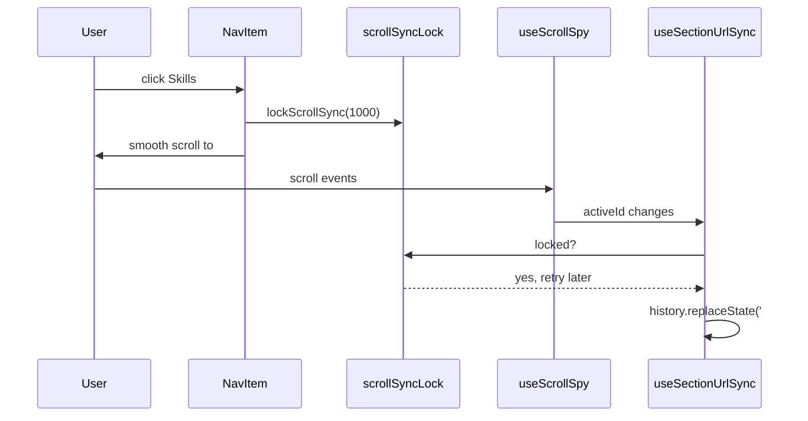

# Navigation and scroll

> **In short:** The navbar is a floating pill on desktop and a menu button on mobile. On the home page, a scroll spy highlights the current section and keeps the URL hash (`#about`, `#skills`...) in sync while you scroll.

## Files involved

| File                                                                                        | What it does                                               |
| ------------------------------------------------------------------------------------------- | ---------------------------------------------------------- |
| `src/components/layout/Navbar/index.tsx`                                                    | Builds the item lists, picks the active item.              |
| `src/components/layout/Navbar/contents.ts`                                                  | All nav items and the home section ids.                    |
| `Navbar/DesktopNav.tsx`, `NavLogo.tsx`, `NavItem.tsx`                                       | Desktop pill nav.                                          |
| `Navbar/StudioMenu.tsx`                                                                     | Dev only "Studio" dropdown.                                |
| `Navbar/MobileNav.tsx`, `MobileMenuButton.tsx`, `MobileMenuPanel.tsx`, `MobileWordmark.tsx` | Mobile menu.                                               |
| `Navbar/hooks/`                                                                             | Small reusable hooks (see below).                          |
| `src/components/layout/SectionUrlSync/`                                                     | Writes the hash while you scroll on home.                  |
| `src/components/layout/HashScroll/`                                                         | Scrolls to the hash on first load.                         |
| `src/components/layout/scrollSyncLock.ts`                                                   | A short timed lock so clicks and scroll sync do not fight. |

## Nav items (`contents.ts`)

- **Sections:** About `/#about`, Skills `/#skills`, Projects `/#work`, Contact `/#contact`.
- **Pages:** Articles (only when articles exist), Uses, Now, Resume.
- **Studio:** Article Editor, only in dev (`isDevelopment` from `src/config/env.ts`).

## How scroll sync works

1. `useScrollSpy` picks the last section whose top is above 30% of the screen. At the page bottom it picks the last section.
2. `SectionUrlSync` (home only) passes that id to `useSectionUrlSync`, which updates the hash with `history.replaceState` (no new history entries). The hero clears the hash.
3. When you click a nav link, the page scrolls through other sections. The lock stops those in between sections from being written. After the lock ends, the sync writes the final one.
4. `HashScroll` (in the root layout) handles opening a URL like `/#skills`: it locks, jumps to the top, waits for fonts (up to 300ms), then scrolls smoothly to the section. When the glide ends (`scrollend`, or after 1.5 s), it checks the page arrived and finishes the trip instantly if a slow device cut the glide short.

## Hooks in `Navbar/hooks/`

| Hook                     | Job                                                          |
| ------------------------ | ------------------------------------------------------------ |
| `useDisclosure`          | Open, close, toggle state.                                   |
| `useCloseOnEscape`       | Close on Escape.                                             |
| `useCloseOnClickOutside` | Close on a click outside.                                    |
| `useCloseOnRouteChange`  | Close when the page changes.                                 |
| `useHeroPassed`          | True once the hero is half out of view. Shows the nav logo.  |
| `useScrollSpy`           | Which section is active.                                     |
| `useScrollY`             | Current scroll position (throttled).                         |
| `useRecentlyChanged`     | True for a short time after a value flips (for transitions). |

These hooks are reused by the share menu, theme menu, and studio editor.

## Desktop and mobile

- **Desktop:** the logo appears after you scroll past the hero. On home, clicking the logo scrolls to the top and clears the hash.
- **Mobile:** a menu button opens a panel with sections, pages, Studio (dev), and the theme toggle. On inner pages, a centred wordmark moves up with scroll and slides into the panel when it opens.

## Good to know

- **Adding a home section?** Add its id to `homeSectionIds` in `contents.ts`, or the scroll spy will skip it.
- **Studio code never ships.** `isDevelopment` is a build time constant, so the bundler removes the branch.

## Related pages

- [Home page](Home-Page.md)
- [Root layout](Root-Layout.md)
- [Article editor studio](Article-Editor-Studio.md)
