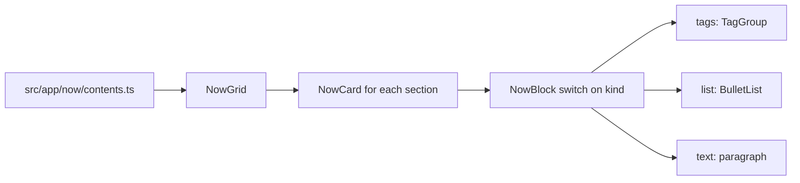

# Now and uses pages

> **In short:** `/now` (what I am doing now) and `/uses` (my gear and tools) are both a grid of cards. The data lives beside the route in `contents.ts`, and each card is made of small "blocks" like tag lists or bullet lists.

## Files involved

| File                                                                                                   | What it does                                               |
| ------------------------------------------------------------------------------------------------------ | ---------------------------------------------------------- |
| `src/app/now/page.tsx`, `contents.ts`                                                                  | Now route and data (`nowMeta`, `nowSections`, `nowQuote`). |
| `src/components/pages/now/types.ts`                                                                    | `NowSectionData`, `NowBlockData`.                          |
| `src/components/pages/now/NowGrid.tsx`, `NowCard/`, `NowBlock.tsx`, `BulletList.tsx`                   | Now UI.                                                    |
| `src/app/uses/page.tsx`, `contents.ts`                                                                 | Uses route and data (`usesSections`).                      |
| `src/components/pages/uses/types.ts`                                                                   | `UsesSectionData`, `UsesBlockData`.                        |
| `src/components/pages/uses/UsesGrid.tsx`, `UsesCard/`, `UsesBlock.tsx`, `SpecList.tsx`, `GearList.tsx` | Uses UI.                                                   |
| `src/components/pages/common/TagGroup.tsx`                                                             | Shared tag list block.                                     |

## How it works

The Uses page is the same shape: `UsesGrid` to `UsesCard` to `UsesBlock`.

## Block kinds

| Kind    | Now | Uses | Shows                                   |
| ------- | --- | ---- | --------------------------------------- |
| `tags`  | Yes | Yes  | A labelled row of tags.                 |
| `list`  | Yes | No   | Bullets in the card's accent colour.    |
| `text`  | Yes | Yes  | A paragraph.                            |
| `specs` | No  | Yes  | A label and value grid (`SpecList`).    |
| `gear`  | No  | Yes  | Name and description rows (`GearList`). |

## A section

Each section has: `title`, an `Icon` component from `src/components/icons/`, optional `intro` (and `outro` on Now), optional `wide` (spans 2 columns), and `blocks`.

## Card colours

Each card's accent hue is `(index * 137.508) % 360`, the "golden angle". This spreads colours evenly, so neighbours never look alike. It feeds the accent bloom (see [Design system](Design-System.md)).

## How to change it

- **Update the Now page:** edit `src/app/now/contents.ts`, and change `nowMeta.lastUpdated` (a plain text date like `'June 2026'`).
- **Add a card:** add an item to the sections array. Use an icon from `src/components/icons/` or add one there.
- **Add a new block kind:** add it to the union in `types.ts`, then a `case` in `NowBlock.tsx` or `UsesBlock.tsx`.

## Good to know

- Types live in the component folder, so `src/components/` never imports from `src/app/`.
- Both pages use `buildPageMetadata` and show a `Breadcrumb`.

## Related pages

- [Resume page](Resume-Page.md)
- [Project structure](Project-Structure.md)
