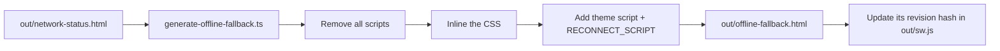

# Offline page

> **In short:** When you open a page offline that was never saved, the service worker shows `offline-fallback.html`. That file is a script free snapshot of the `/network-status` route. It checks the connection and reloads by itself when you are back online.

## Files involved

| File                                                           | What it does                                                          |
| -------------------------------------------------------------- | --------------------------------------------------------------------- |
| `src/app/network-status/page.tsx`                              | The route. Not indexed and not in the sitemap.                        |
| `src/components/pages/network-status/NetworkStatusStage/`      | The page UI: status pill, title, text, buttons, auto reload box.      |
| `src/components/pages/network-status/SignalRings/`             | The pure CSS radar animation.                                         |
| `src/components/pages/network-status/NetworkStatusActions.tsx` | "Try again" and "Back home" buttons.                                  |
| `src/components/pages/network-status/reconnect.ts`             | `RECONNECT_SCRIPT`: plain JS that watches the connection.             |
| `scripts/generate-offline-fallback.ts`                         | Turns the built route into `out/offline-fallback.html`.               |
| `public/offline-fallback.html`                                 | A simple committed placeholder, used in dev or if the snapshot fails. |

## How the fallback is made

1. This is the **last** step of `pnpm build`.
2. The script reads the built `network-status.html` and removes every `<script>` (Next.js chunks, data, JSON-LD).
3. It inlines the `/_next/` stylesheets, so the page needs no other files.
4. It adds a tiny theme script (same logic as `ThemeScript`) and the reconnect script.
5. It writes `out/offline-fallback.html` and puts the file's MD5 into `out/sw.js`, so browsers re-download it after a change.

**Why a plain file?** A full Next.js page served at a random URL would start the router, which would then show "not found".

## How reconnect works

`RECONNECT_SCRIPT` is the same code on the live route and in the snapshot.

- It asks `/version.json?probe=<time>` with `no-store`. A reply means online.
- It does not trust `navigator.onLine === true`, because captive portals and DevTools can fake it.
- It probes every 5 seconds until online, and also on the `online` event.
- When online, it sets `data-status="online"`. CSS then turns the accent from amber to green and shows the auto reload box.
- If the page is acting as the fallback (the URL is not `/network-status`), it counts down 5 seconds and reloads.
- The auto reload choice is saved in `localStorage` as `network-auto-reload` (on by default).

## Good to know

- Test it with `pnpm build`, `pnpm preview`, then turn the network off in DevTools and open a new page.
- The comment inside `public/offline-fallback.html` still mentions an old `/offline` route. The route is now `/network-status`.

## Related pages

- [PWA and offline](PWA-and-Offline.md)
- [Error pages](Error-Pages.md)
