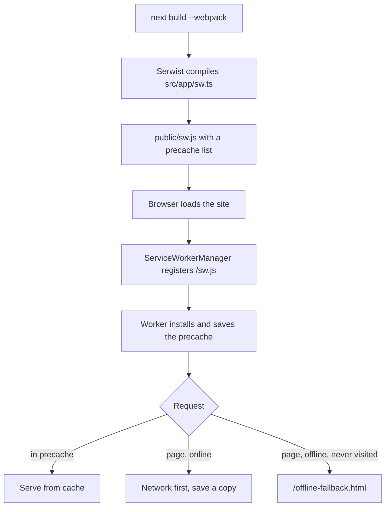

# PWA and offline

> **In short:** The site is an installable app (PWA). A service worker, built with Serwist, saves files in the browser so pages you have visited still work offline. It only exists in production builds.

## Files involved

| File                                       | What it does                                                          |
| ------------------------------------------ | --------------------------------------------------------------------- |
| `next.config.ts`                           | `withSerwistInit(...)`: builds the worker and picks what to precache. |
| `src/app/sw.ts`                            | The service worker source: caching rules and offline fallback.        |
| `src/app/manifest.ts`                      | The web app manifest (name, icons, screenshots).                      |
| `src/components/pwa/ServiceWorkerManager/` | Registers the worker in the browser.                                  |
| `public/sw.js`, `public/swe-worker-*.js`   | Generated worker files (git ignored).                                 |

## Words to know

- **Service worker:** a small script the browser runs in the background. It can answer network requests from a local cache.
- **Precache:** files saved when the worker installs. They are always there.
- **Runtime cache:** files saved later, as you browse.

## How it works

1. `pnpm build` runs Next.js with webpack, because Serwist is a webpack plugin. (Dev uses Turbopack and has no worker.)
2. Serwist compiles `src/app/sw.ts` into `public/sw.js` and puts a list of files to precache inside it.
3. In the browser, `ServiceWorkerManager` registers `/sw.js` by hand (`register: false` in the config) so the update toast can control the swap. See [App updates](App-Updates.md).
4. The worker saves the precache, then answers requests using the rules below.

## What is precached

- All `/_next/static/` files (the JavaScript and CSS app shell).
- Everything in `public/` (images, icons, OG images, `giscus-*.css`, `offline-fallback.html`).
- The home page `/`. It is added with a `manifestTransforms` step in `next.config.ts`, with the build time as its revision, so it refreshes on each deploy.

Other HTML pages are **not** precached. They are saved when you visit them.

## Runtime caching rules

`src/app/sw.ts` uses Serwist's `defaultCache`, minus its last two rules (the cross origin and catch all rules). Those were removed because blocked third party scripts from GTM caused service worker errors. Third party requests now go straight to the browser.

| Request type           | Strategy                              |
| ---------------------- | ------------------------------------- |
| Images, fonts, CSS, JS | Stale while revalidate or cache first |
| JSON, XML              | Network first                         |
| HTML pages             | Network first (cache `pages`)         |

**Network first** means: try the internet, and use the saved copy only if that fails.

## Saving pages as you browse

`cacheOnNavigation: true` adds a helper to the app. On every client side navigation (while online) it asks a small web worker (`swe-worker-*.js`) to fetch the full HTML page and store it in the `pages` cache. That is why a page you opened by clicking a link still works offline later.

## The manifest

`src/app/manifest.ts` is served at `/manifest.webmanifest`. It sets:

- Name `Shibbir Ahmed`, short name `Shibbir`, `start_url: '/'`, `display: 'standalone'`.
- Icons: `public/shibbir-logo-{144,192,512}x*.png`, with `maskable` versions for 192 and 512.
- Screenshots: `public/screenshot-640x320.png` (wide) and `public/screenshot-637x911.png` (narrow).

## Good to know

- **Test it with a real build.** Run `pnpm build`, then `pnpm preview` (or `preview:https`). See [Local preview](Local-Preview.md).
- **Service workers need HTTPS** or `localhost`.
- **Offline, never visited pages** show the offline page. See [Offline page](Offline-Page.md).
- The manifest colours are fixed `#ffffff`, while the browser bar colour follows the theme (set in `layout.tsx`).

## Related pages

- [App updates](App-Updates.md)
- [Offline page](Offline-Page.md)
- [Build and deploy](Build-and-Deploy.md)
