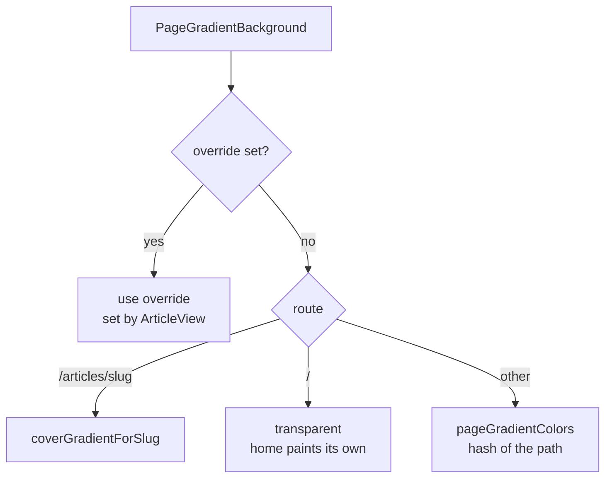

# Page backgrounds

> **In short:** Every page sits on a soft two colour wash. Article pages use their cover colours, other pages get colours from a hash of the URL, and the home page paints its own per section swells. The footer shows a name signature that reveals binary digits near the cursor.

## Files involved

| File                                                            | What it does                                   |
| --------------------------------------------------------------- | ---------------------------------------------- |
| `src/components/backgrounds/PageGradientBackground/index.tsx`   | The wash behind every page.                    |
| `PageGradientBackground/PageGradientProvider.tsx`               | Context so a page can override the colours.    |
| `PageGradientBackground/SyncPageGradient.tsx`                   | Sets the override on mount, clears on unmount. |
| `src/utils/pageGradient.ts`                                     | URL to colour pair (hash based).               |
| `src/components/backgrounds/GridBackground.tsx`                 | Grid lines (hero, error pages, offline page).  |
| `src/components/wrappers/WithGridAnimatedBackgroundWrapper.tsx` | Hero wrapper with a pulsing grid.              |
| `src/components/layout/Footer/SignatureSpotlight/`              | The footer signature effect.                   |

## How the page wash picks colours

1. `PageGradientBackground` is always mounted in the root layout, behind everything (`-z-10`).
2. It writes `--page-grad-from` and `--page-grad-to` inline.
3. Both are registered with `@property`, so a route change cross fades them over 700ms.
4. The wash strength is 6% in light and 12% in dark.

**Hash colours:** `pageGradientColors` hashes the path. The first hue is `hash % 360`, and the second is 120 to 200 degrees away. So each page has its own stable tint.

## Home section swells

Home is transparent here because `globals.css` gives each `main.home-sections > section` its own vertical gradient. The colours cycle through `--section-swell-indigo`, `blue`, `yellow`, and `teal`.

## Footer signature

- Two layers stacked in one grid cell: the solid "Shibbir" SVG, and a field of 0 and 1 digits cut to the same letter shapes with an SVG mask.
- `usePointerSpotlight` tracks the pointer across the window and shows the digits in a circle near it, fading with distance. It writes CSS variables directly, with no React re-render.
- `useBinaryFlicker` flips a few digits every 420ms, only while the spotlight is visible.
- The digits come from a seeded random generator (`binaryField.ts`), so server and client HTML match.
- Touch devices and reduced motion get the plain signature.

## Good to know

- To tint a new page from its own data, render `<SyncPageGradient colors={[from, to]} />` in it.
- Grid colours come from `--grid-line` and `--grid-dot` in `globals.css`.

## Related pages

- [Design system](Design-System.md)
- [Home page](Home-Page.md)
- [Root layout](Root-Layout.md)
