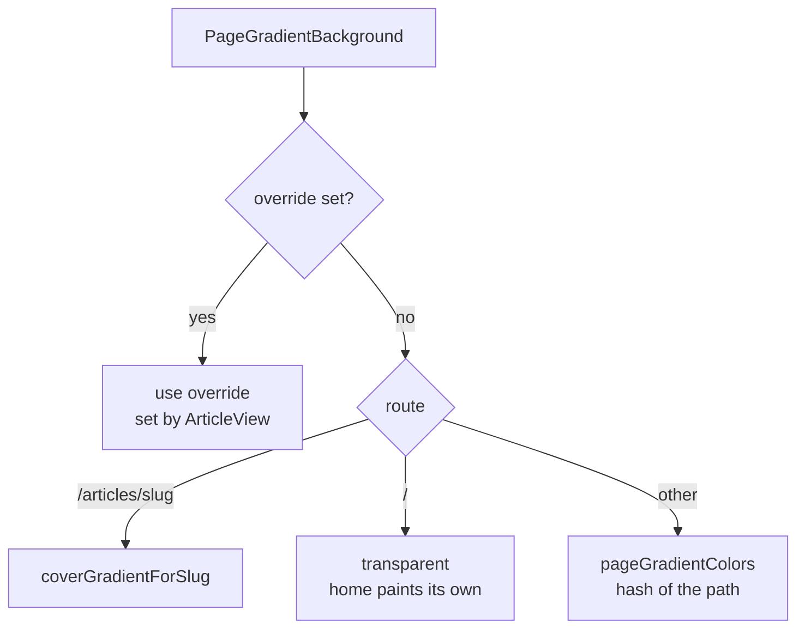

# Page backgrounds

> **In short:** Every page sits on a soft two colour wash. Article pages use their cover colours, other pages get colours from a hash of the URL, and the home page paints its own per section swells. The footer name signature is drawn as a faint GitHub style contribution graph that brightens near the cursor.

## Files involved

| File                                                            | What it does                                   |
| --------------------------------------------------------------- | ---------------------------------------------- |
| `src/components/backgrounds/PageGradientBackground/index.tsx`   | The wash behind every page.                    |
| `PageGradientBackground/PageGradientProvider.tsx`               | Context so a page can override the colours.    |
| `PageGradientBackground/SyncPageGradient.tsx`                   | Sets the override on mount, clears on unmount. |
| `src/utils/pageGradient.ts`                                     | URL to colour pair (hash based).               |
| `src/components/backgrounds/GridBackground.tsx`                 | Grid lines (hero, error pages, offline page).  |
| `src/components/wrappers/WithGridAnimatedBackgroundWrapper.tsx` | Hero wrapper with a pulsing grid.              |
| `src/components/layout/Footer/SignatureSpotlight/`              | The footer signature effect.                   |

## How the page wash picks colours

1. `PageGradientBackground` is always mounted in the root layout, behind everything (`-z-10`).
2. It writes `--page-grad-from` and `--page-grad-to` inline.
3. Both are registered with `@property`, so a route change cross fades them over 700ms.
4. The wash strength is 6% in light and 12% in dark.

**Hash colours:** `pageGradientColors` hashes the path. The first hue is `hash % 360`, and the second is 120 to 200 degrees away. So each page has its own stable tint.

## Home section swells

Home is transparent here because `globals.css` gives each `main.home-sections > section` its own vertical gradient. The colours cycle through `--section-swell-indigo`, `blue`, `yellow`, and `teal`.

## Footer signature

- Two layers stacked in one grid cell: the solid "Shibbir" SVG, and a canvas that redraws the letters as GitHub style contribution squares.
- The squares always show faintly (`--graph-rest` in `SignatureSpotlight.module.css`). `usePointerSpotlight` tracks the pointer across the window and writes CSS variables to the signature box, with no React re-render. Both layers read them: the squares rise to full strength in a circle near the pointer, and in dark mode the solid letter fades out there by the same amount. Light mode keeps the solid letter behind the squares (`--solid-keep`), because the pale gaps would otherwise break its smooth edge into stair steps. The circle and its brightness ease after the pointer (`easeToward` in `src/utils/`) instead of snapping.
- `useActivityGraph` keeps a square wherever its centre falls inside the letter path (`activityField.ts`), draws them with `drawActivityGraph.ts`, and changes a few levels every 900ms while the spotlight is lit. Each changed square fades to its new shade over about two seconds (`activityColors.ts` blends the in-between shades). It redraws when the theme changes.
- The five square colours are the `--activity-level-0` to `4` grayscale variables in `SignatureSpotlight.module.css`, with a dark set for dark mode.
- Touch devices and reduced motion get the faint graph, standing still.

## Good to know

- To tint a new page from its own data, render `<SyncPageGradient colors={[from, to]} />` in it.
- Grid colours come from `--grid-line` and `--grid-dot` in `globals.css`.

## Related pages

- [Design system](Design-System.md)
- [Home page](Home-Page.md)
- [Root layout](Root-Layout.md)
