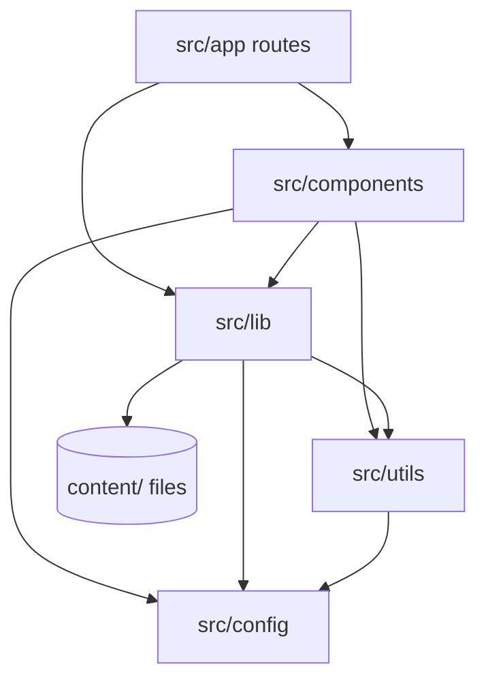

# Project structure

> **In short:** `src/app/` holds routes only. `src/components/` holds every component. Data lives in `contents.ts` files and `src/config/constants.ts`. Articles live in `content/articles/`.

## Top level folders

| Folder            | What is inside                                                                   |
| ----------------- | -------------------------------------------------------------------------------- |
| `src/app/`        | Routes: `page.tsx`, `layout.tsx`, feeds, sitemap, robots, manifest, `sw.ts`.     |
| `src/components/` | All React components, grouped by purpose.                                        |
| `src/lib/`        | Loaders and logic used at build time (articles, markdown, feeds, resume).        |
| `src/utils/`      | Small pure helper functions (`cn`, dates, JSON-LD builders, search).             |
| `src/config/`     | Site constants, fonts, and environment flags.                                    |
| `src/types/`      | Global TypeScript declarations (for example `*.css` imports).                    |
| `content/`        | Article markdown files and the resume PDF source.                                |
| `public/`         | Static files copied as is into the build. Some are generated.                    |
| `scripts/`        | Build helper scripts run with `tsx` (covers, OG images, resume, and more).       |
| `tests/`          | Test setup, content checks, build checks, browser tests ([Testing](Testing.md)). |
| `docker/`         | Files for the Docker HTTPS preview.                                              |
| `openspec/`       | Feature specs and archived change proposals.                                     |
| `docs/wiki/`      | This wiki.                                                                       |

## How the layers depend on each other

Arrows point from the importer to what it imports. The key rule: **components never import from `src/app/`**. If a route and its components share a type, the type goes in a `types.ts` inside the component folder.

## Component groups

| Group            | Examples                                                           |
| ---------------- | ------------------------------------------------------------------ |
| `analytics/`     | Google Tag Manager, pageview tracker.                              |
| `animations/`    | `AnimatedUnderline`, `ShinyTextAnimation`.                         |
| `backgrounds/`   | Grid, dots, and the page gradient.                                 |
| `icons/`         | SVG icon components. `icons/tech/` holds tech logos.               |
| `layout/`        | Navbar, Footer, ThemeToggle, Breadcrumb, scroll helpers.           |
| `pwa/`           | Service worker manager and update toast.                           |
| `seo/`           | JSON-LD script tags.                                               |
| `ui/`            | Base inputs: `Button`, `Input`, `Textarea`, `Checkbox`, `Spinner`. |
| `wrappers/`      | Layout wrappers such as the animated grid wrapper.                 |
| `pages/<route>/` | Components for one route (`home`, `articles`, `resume`, `now`...). |
| `pages/common/`  | Primitives shared across sections (`SectionHeading`, `Tag`).       |

## Where data lives

- **Site wide facts** (name, URLs, social links, keys): `src/config/constants.ts`. Edit here first.
- **Component data** (a list only one component shows): `contents.ts` inside that component's folder, for example `src/components/pages/home/ProjectsArea/contents.ts`.
- **Page data** (a list the route owns): `contents.ts` beside the route, for example `src/app/now/contents.ts`.
- **Articles**: `content/articles/NN-slug.md`.

## Naming and file rules

- **Imports always use `@/`**, even for a file in the same folder. No `./` or `../`.
- A folder that **is** a component is PascalCase with an `index.tsx` (`Navbar/index.tsx`). A group folder is lowercase (`layout/`).
- A single file component stays a single `.tsx` file.
- Side effects (`useEffect`, listeners, observers) go in a named hook in a `hooks/` folder beside the component.
- No nested ternaries. Use a small helper with early returns.
- No `Component` suffix on names.

## Related pages

- [Configuration](Configuration.md)
- [Design system](Design-System.md)
- [Tooling](Tooling.md)
