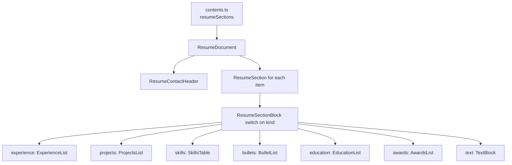

# Resume page

> **In short:** `/resume` is an HTML resume built from `src/app/resume/contents.ts`. The "Download PDF" button calls `window.print()`, and print styles turn the page into a clean black on white document.

## Files involved

| File                                                 | What it does                                                |
| ---------------------------------------------------- | ----------------------------------------------------------- |
| `src/app/resume/page.tsx`                            | The route: metadata, breadcrumb, button, document, JSON-LD. |
| `src/app/resume/contents.ts`                         | All resume data: name, location, contacts, sections.        |
| `src/components/pages/resume/types.ts`               | Types for every section kind.                               |
| `src/components/pages/resume/ResumeDocument.tsx`     | The card that holds the whole resume.                       |
| `src/components/pages/resume/ResumeSectionBlock.tsx` | Picks the right body component for each section `kind`.     |
| `src/components/pages/resume/DownloadPdfButton.tsx`  | Calls `window.print()`.                                     |
| `src/utils/resumeJsonLd.ts`                          | `ProfilePage` JSON-LD for the resume.                       |
| `src/lib/resume.ts`, `scripts/prepare-resume.ts`     | Old static PDF helpers (see "Good to know").                |

## How it works

1. `resumeSections` is an ordered list. The array order is the page order.
2. Each section has a `kind`. `ResumeSectionBlock` picks the matching list component.
3. The card uses the accent bloom and cursor spotlight on screen, with a neutral accent.

## Print and PDF

- The button runs `window.print()`. The visitor saves it as PDF from the print dialog.
- All print styling uses Tailwind `print:` variants. There is no `@media print` in `globals.css`.
- The navbar, footer, breadcrumb, and button are hidden in print.
- `<main>` forces `--background: #fff` and `--foreground: #000` in print, so dark mode still prints black on white.
- The document switches to Helvetica at 10pt, and items use `print:break-inside-avoid`.
- Tech chips become a comma list in print.

## How to change it

- **Edit content:** change `src/app/resume/contents.ts`.
- **Add a new section layout:** add a `kind` to the union in `types.ts`, a `case` in `ResumeSectionBlock.tsx`, and a body component.

## Good to know

- **The resume name is separate** (`resumeName` in `contents.ts`) from `siteName`.
- **Old PDF flow.** `gen:resume` still copies a real PDF from `content/resume/` to `public/resume-shibbir-ahmed.pdf`, but nothing links to it now. Real PDFs in `content/resume/` are git ignored. Only the `.example.pdf` placeholder is committed.
- **JSON-LD** is a `ProfilePage` whose `Person` shares the `#person` id with the home page. Production only.
- OG image: `resumeThumbnail` from `constants.ts`.

## Related pages

- [Now and uses pages](Now-and-Uses-Pages.md)
- [SEO and structured data](SEO-and-Structured-Data.md)
