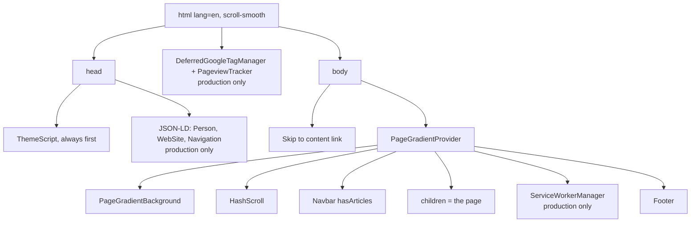

# Root layout

> **In short:** `src/app/layout.tsx` wraps every page. It sets the site metadata, applies the theme before paint, and renders the navbar, the page, the update toast, and the footer. Some parts only render in production.

## Files involved

| File                                                 | What it does                                      |
| ---------------------------------------------------- | ------------------------------------------------- |
| `src/app/layout.tsx`                                 | The root layout and site wide `metadata`.         |
| `src/app/globals.css`                                | Tailwind, theme tokens, shared utilities.         |
| `src/config/fonts.ts`                                | Noto Sans (body) and Zain (hero name).            |
| `src/config/monoFont.ts`                             | JetBrains Mono, loaded only by pages that use it. |
| `src/components/layout/ThemeToggle/ThemeScript.tsx`  | No flash theme script.                            |
| `src/components/backgrounds/PageGradientBackground/` | Page tint behind everything.                      |
| `src/components/layout/HashScroll/`                  | Scrolls to `#hash` on first load.                 |
| `src/components/layout/Navbar/`, `Footer/`           | Site chrome.                                      |

## What it renders

1. **ThemeScript** runs first so the right theme is set before anything paints. See [Theme system](Theme-System.md).
2. **JSON-LD** for the person, the website, and the navigation. See [SEO and structured data](SEO-and-Structured-Data.md).
3. **Analytics** loads late. See [Analytics](Analytics.md).
4. **Skip link** is the first focusable element. It jumps to `<main id="main">` on each page.
5. **PageGradientProvider** lets an article page share its cover colours with the background.
6. **Navbar** gets `hasArticles` so it can hide the Articles link when there are no posts.
7. **ServiceWorkerManager** is the last child of the main wrapper, so its update toast floats over content and stops above the footer. See [App updates](App-Updates.md).

## Site metadata

`metadata` in `layout.tsx` sets:

- `metadataBase` from `siteURL`, and the canonical `/`.
- Title default `Shibbir Ahmed | Senior Full-Stack & AI Engineer`, and the template `%s | Shibbir Ahmed` for other pages.
- OpenGraph (`profile`) and Twitter card, both using `/opengraph-image.png`.
- Links to the RSS, Atom, and JSON feeds.
- Robots, keywords, authors, and Facebook and Pinterest tags.

`viewport.themeColor` makes the phone status bar match the theme (`#ededed` light, `#0a0a0a` dark).

## Fonts

| Font           | Variable                 | Used for                                   |
| -------------- | ------------------------ | ------------------------------------------ |
| Noto Sans      | `--font-noto-sans`       | All body text. Set on `<body>`.            |
| Zain           | `--font-zain-sans-serif` | Only the hero name. `display: 'optional'`. |
| JetBrains Mono | `--font-jetbrains-mono`  | Code, breadcrumbs, resume, article pages.  |

`globals.css` maps them to Tailwind as `font-sans`, `font-display`, and `font-mono`.

## Good to know

- **Print mode.** The navbar, footer, and skip link have `print:hidden`, and the body turns white, so `/resume` prints as a clean document.
- **`suppressHydrationWarning`** on `<html>` is needed because `ThemeScript` changes `data-theme` before React loads.
- **Every page needs `<main id="main">`** for the skip link to work.

## Related pages

- [Theme system](Theme-System.md)
- [Navigation and scroll](Navigation-and-Scroll.md)
- [Page backgrounds](Page-Backgrounds.md)
