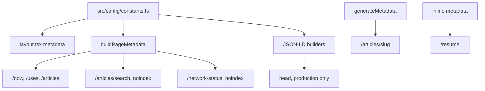

# SEO and structured data

> **In short:** The root layout sets site wide metadata. Each page adds its own title, canonical URL, and OG image, usually through `buildPageMetadata`. JSON-LD (schema.org data for search engines) is added in production only. `sitemap.xml` and `robots.txt` are built statically.

## Files involved

| File                                                | What it does                                        |
| --------------------------------------------------- | --------------------------------------------------- |
| `src/app/layout.tsx`                                | Site metadata, feeds, icons, and site wide JSON-LD. |
| `src/utils/pageMetadata.ts`                         | `buildPageMetadata()` for normal pages.             |
| `src/utils/jsonLd.ts`                               | `ProfilePage` + `Person` (home and every page).     |
| `src/utils/siteJsonLd.ts`                           | `WebSite` and the site navigation list.             |
| `src/utils/breadcrumbJsonLd.ts`                     | `BreadcrumbList`, used by `Breadcrumb`.             |
| `src/utils/articleJsonLd.ts`                        | `BlogPosting` for each article.                     |
| `src/utils/resumeJsonLd.ts`                         | `ProfilePage` for the resume.                       |
| `src/components/seo/JsonLdScript.tsx`, `JsonLd.tsx` | Render JSON-LD `<script>` tags safely.              |
| `src/app/sitemap.ts`, `src/app/robots.ts`           | Sitemap and robots, both `force-static`.            |

## How metadata flows

## `buildPageMetadata`

`buildPageMetadata({ title, description, path, image?, robots? })` returns title, description, `canonical = path`, OpenGraph, and Twitter images. The image defaults to `defaultThumbnail`.

It exists because Next.js does **not** deep merge a page's `openGraph` with the layout's. Without it, a page that sets any OG field would lose the rest.

## JSON-LD

| Builder                 | Type                                    | Where it renders         |
| ----------------------- | --------------------------------------- | ------------------------ |
| `jsonLd`                | `ProfilePage` with `Person` (`#person`) | Every page, in `<head>`. |
| `websiteJsonLd`         | `WebSite` (`#website`)                  | Every page, in `<head>`. |
| `siteNavigationJsonLd`  | `ItemList` of nav links                 | Every page, in `<head>`. |
| `buildBreadcrumbJsonLd` | `BreadcrumbList`                        | Pages with a breadcrumb. |
| `buildArticleJsonLd`    | `BlogPosting`                           | Each article.            |
| `resumeJsonLd`          | `ProfilePage`                           | `/resume`.               |

- All are typed with `schema-dts`.
- They link together by `@id`: articles and the resume point to `#person`.
- They only render when `process.env.NODE_ENV === 'production'`, so you will not see them in `pnpm dev`.
- The script renderers escape `<` so content cannot break out of the tag.

## Sitemap and robots

- **Sitemap** lists `/`, `/uses`, `/now`, `/resume`, and when there are posts, `/articles` and each article (with its date and image). `lastModified` comes from the build time, so it stays the same for unchanged content.
- **Not in the sitemap:** `/articles/search`, `/network-status`, the studio, and the feeds.
- **Robots** allows everything and points to `/sitemap.xml`.

## How to change it

- **Site name, description, keywords, social links:** `src/config/constants.ts`.
- **New page:** export `metadata = buildPageMetadata({...})`, and add the path to `sitemap.ts`.
- **Check JSON-LD:** run `pnpm build` and `pnpm preview`, then view the page source or use Google's Rich Results Test.

## Related pages

- [Configuration](Configuration.md)
- [Covers and OG images](Covers-and-OG-Images.md)
- [Feeds](Feeds.md)
