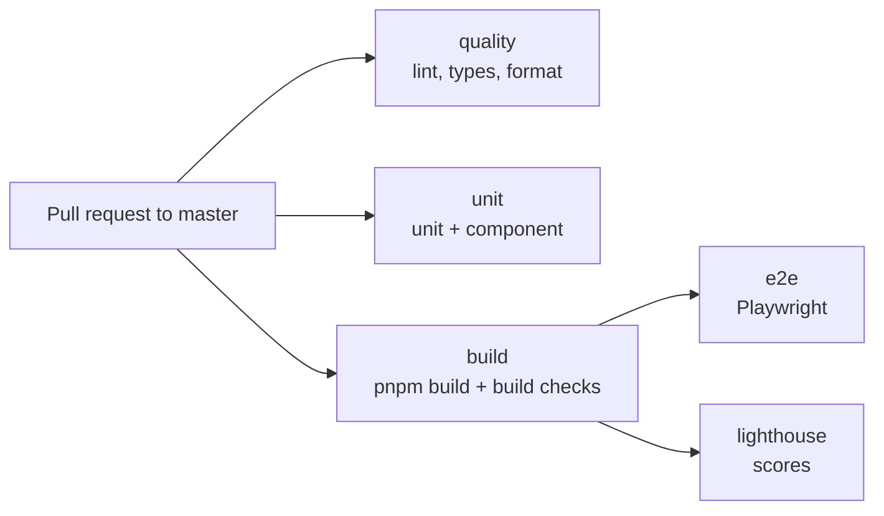

# Testing

> **In short:** Five kinds of tests guard the site: unit and component tests (Vitest), build checks on `./out`, browser tests (Playwright), and Lighthouse scores. They all run on every pull request to `master` through `.github/workflows/ci.yml`.

## Files involved

| File                       | What it does                                                  |
| -------------------------- | ------------------------------------------------------------- |
| `vitest.config.mts`        | Three Vitest projects: `unit`, `component`, `build`.          |
| `src/**/*.test.ts(x)`      | Unit and component tests, next to the code they test.         |
| `tests/content/`           | Checks on real content: articles, diagrams, data files, copy. |
| `tests/build/`             | Checks on the finished export in `./out`.                     |
| `tests/e2e/`               | Playwright browser tests.                                     |
| `tests/setup/`             | Shared setup for each Vitest project.                         |
| `playwright.config.ts`     | Browser test config and the four screen sizes.                |
| `lighthouserc.cjs`         | Lighthouse pages and minimum scores.                          |
| `.github/workflows/ci.yml` | Runs everything on each pull request.                         |

## What runs on a pull request



`e2e` and `lighthouse` download the exact `./out` that `build` made, so all three test the same site.

## The test types

| Type       | Command                | What it checks                                                             |
| ---------- | ---------------------- | -------------------------------------------------------------------------- |
| Unit       | `pnpm test:unit`       | Pure logic: markdown, posts, feeds, search, JSON-LD, flow parser.          |
| Content    | `pnpm test:unit`       | Every article's frontmatter, every diagram parses, no em dash, wiki links. |
| Component  | `pnpm test:component`  | React components and hooks in jsdom (forms, menus, search, theme).         |
| Build      | `pnpm test:build`      | Routes, SEO tags, JSON-LD, sitemap, feeds, PWA files, links, size budgets. |
| Browser    | `pnpm test:e2e`        | Real clicks in Chromium: features, responsive layout, a11y, offline.       |
| Lighthouse | `pnpm test:lighthouse` | Performance, accessibility, best practices, SEO scores.                    |

## Screen sizes (Playwright projects)

| Project   | Size          | Runs                                |
| --------- | ------------- | ----------------------------------- |
| `desktop` | 1440 x 900    | Every spec.                         |
| `laptop`  | 1024 x 768    | Responsive and navigation.          |
| `tablet`  | Galaxy Tab S4 | Responsive and accessibility.       |
| `mobile`  | Pixel 7       | Everything that changes on a phone. |

## Run it locally

```bash
pnpm test              # unit + component (fast, no build needed)
pnpm build             # needed before the next three
pnpm test:build
pnpm test:e2e:install  # once: downloads Chromium
pnpm test:e2e
pnpm test:lighthouse   # needs Google Chrome installed
pnpm test:ci           # everything, in CI order
```

Useful extras: `pnpm test:watch`, `pnpm test:coverage`, and `pnpm test:e2e --ui` to watch browser tests run.

## Writing a new test

- **Put unit and component tests beside the code**: `Foo.tsx` gets `Foo.test.tsx`. `.test.ts` runs in Node, `.test.tsx` runs in jsdom.
- **Use `@/` imports** (and `@tests/` for test helpers), like all other code.
- **Browser specs import `test` from `@tests/e2e/fixtures`**. It blocks all third-party requests and fails on any page error. Mock a service with `page.route`.
- **Wait with `waitForHydration(page)`** before checking diagrams or copy buttons, not `networkidle`.
- **Test what a visitor sees**: roles, labels, and text, not class names.
- **A new page?** Add it to `tests/e2e/routes.ts` so the layout and a11y sweeps cover it.

## Good to know

- **Budgets live in `tests/build/performance.test.ts`.** If a change truly needs more JavaScript, raise the number in the same PR and say why.
- **Formatting is checked only on files the PR changes.** Many older files are not Prettier formatted yet; fix a file when you edit it.
- **Service workers are blocked** in browser tests except `pwa.spec.ts`, because they would hide requests from `page.route`.
- **Failed CI runs upload reports**: `playwright-report`, `coverage`, and `lighthouse-reports` artifacts on the run page.

## Related pages

- [Getting started](Getting-Started.md)
- [Build and deploy](Build-and-Deploy.md)
- [Tooling](Tooling.md)
