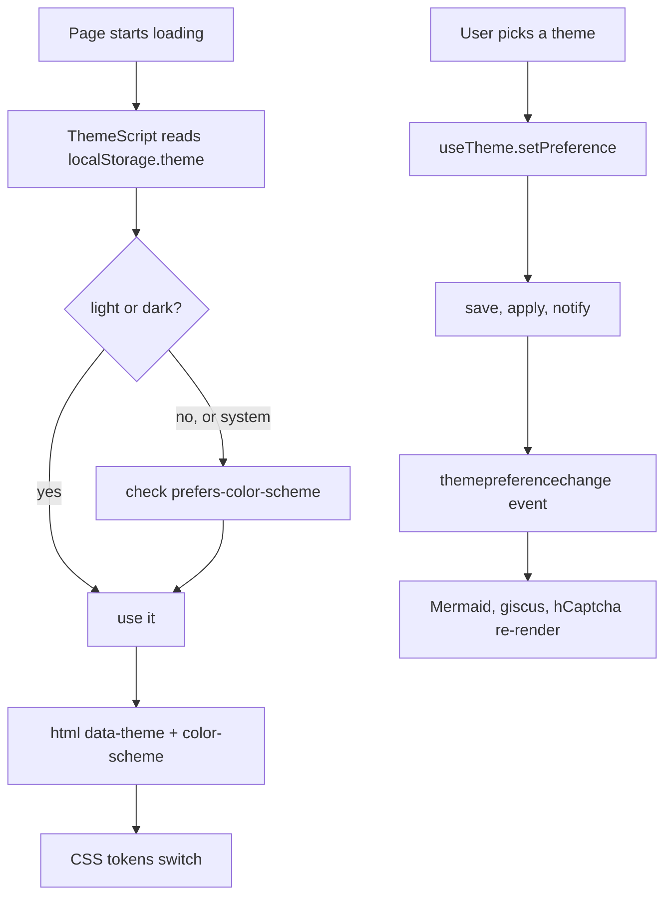

# Theme system

> **In short:** Users pick System, Light, or Dark. Only that choice is saved (in `localStorage` as `theme`). The resolved value, `light` or `dark`, is written to `<html data-theme="...">`, and CSS reads it.

## Files involved

All paths are under `src/components/layout/ThemeToggle/`.

| File                        | What it does                                                   |
| --------------------------- | -------------------------------------------------------------- |
| `theme.ts`                  | Core logic: read, save, resolve, apply, and subscribe.         |
| `ThemeScript.tsx`           | Inline script in `<head>` that applies the theme before paint. |
| `hooks/useTheme.ts`         | React hook: current choice plus `setPreference`.               |
| `hooks/useResolvedTheme.ts` | React hook: just `light` or `dark`.                            |
| `options.ts`                | The three choices and their icons.                             |
| `ThemeMenu.tsx`             | Desktop: round button with a dropdown (top right).             |
| `index.tsx`                 | Mobile: three button toggle inside the menu panel.             |
| `src/app/globals.css`       | Colour tokens and the `dark` variant.                          |

## How it works



1. **Before paint**, `ThemeScript` resolves the theme and sets `data-theme` and `colorScheme` on `<html>`. No flash of the wrong theme.
2. **After hydration**, `useTheme` reads the saved choice and subscribes to changes.
3. **When the user picks**, `setPreference` saves the choice, applies it, and fires a `themepreferencechange` window event.
4. **`subscribe()`** in `theme.ts` listens to three things: that event, `storage` events from other tabs, and OS colour scheme changes.

## CSS side

- `@custom-variant dark` in `globals.css` matches `[data-theme='dark']`. It also matches `prefers-color-scheme: dark` when there is no `data-theme` (no JavaScript).
- Main tokens: `--background` (`#ededed` light, `#0a0a0a` dark) and `--foreground` (`#171717` light, `#ededed` dark).
- `--background` and the section swell colours are registered with `@property`, so they fade over 400ms on a theme switch. Text colour snaps.
- CSS Modules that need their own dark values use this pair of selectors:

```css
:global(html[data-theme='dark']) .card {
    --glow: 16%;
}
@media (prefers-color-scheme: dark) {
    :global(html:not([data-theme])) .card {
        --glow: 16%;
    }
}
```

## Who listens to theme changes

- **Mermaid and flow diagrams** render again with new colours.
- **giscus comments** get a `setConfig` message with the new theme CSS.
- **hCaptcha** in the contact form re-renders with the new theme.

## Good to know

- **"system" never reaches the DOM.** Only `light` or `dark` is written to `data-theme`.
- **Keep `ThemeScript` and `theme.ts` in step.** The inline script copies the logic of `resolvePreference` and `applyPreference`.
- **Hooks start with safe defaults** (`system` and `light`) to avoid hydration mismatch, then update after mount.
- The offline page has its own copy of the theme script. See [Offline page](Offline-Page.md).

## Related pages

- [Root layout](Root-Layout.md)
- [Design system](Design-System.md)
