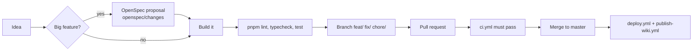

# Tooling

> **In short:** TypeScript in strict mode, ESLint for code checks, Prettier for formatting, and OpenSpec for planning bigger features. Tests use Vitest, Playwright, and Lighthouse CI (see [Testing](Testing.md)).

## Files involved

| File                     | What it does                                                          |
| ------------------------ | --------------------------------------------------------------------- |
| `tsconfig.json`          | Strict TypeScript and the `@/*` to `./src/*` path alias.              |
| `eslint.config.mjs`      | ESLint 9 flat config: Next.js core web vitals, TypeScript, Prettier.  |
| `vitest.config.mts`      | Unit, component, and build test projects.                             |
| `playwright.config.ts`   | Browser tests and screen sizes.                                       |
| `lighthouserc.cjs`       | Lighthouse pages and minimum scores.                                  |
| `prettier.config.mjs`    | Formatting rules and the Tailwind class sorter plugin.                |
| `pnpm-workspace.yaml`    | Which dependencies may run install scripts (`allowBuilds`).           |
| `.vscode/`               | Recommended editor extensions and settings.                           |
| `openspec/`              | Specs for features and archived change proposals.                     |
| `.claude/`               | AI assistant settings, OpenSpec commands and skills.                  |
| `CLAUDE.md`, `AGENTS.md` | House rules for code, copy, and git. Read these before changing code. |

## Formatting rules (Prettier)

- 4 spaces for indentation.
- Semicolons on.
- Single quotes.
- Trailing commas where ES5 allows them.
- One JSX attribute per line.
- Tailwind classes are sorted automatically.

Run `pnpm format` to fix everything, or `pnpm exec prettier --write <path>` for one file.

## Lint rules (ESLint)

- Extends `next/core-web-vitals`, `next/typescript`, and `prettier` (which turns off rules that fight Prettier).
- Build output and generated files are ignored: `.next/`, `out/`, `public/sw.js`, and the image optimizer output.

## How a change moves from idea to master

## OpenSpec

OpenSpec is a light planning workflow. A bigger feature starts as a **change** with a proposal, a design, a task list, and spec deltas.

- Live specs: `openspec/specs/<capability>/spec.md` (for example `pwa`, `analytics`, `article-feeds`, `article-comments`, `error-pages`).
- Finished changes: `openspec/changes/archive/<date>-<name>/`.
- The `/opsx:*` commands in `.claude/commands/opsx/` drive it: propose, apply, sync, archive.

The specs are a good place to read **why** a feature behaves the way it does.

## Git rules

- Never commit straight to `master`. Use a `feat/...`, `fix/...`, or `chore/...` branch.
- `master` only moves through merged pull requests.
- No AI co-author lines in commits or PRs.

## Good to know

- **Tests run on every PR.** `.github/workflows/ci.yml` runs lint, types, all test suites, and Lighthouse. See [Testing](Testing.md).
- **Formatting debt.** Many older files are not Prettier formatted yet, so CI checks formatting only on the files a PR changes.
- **`next lint` is gone** in Next 16, so `pnpm lint` runs `eslint` directly.
- **No em dash** anywhere in the project, including this wiki.

## Related pages

- [Getting started](Getting-Started.md)
- [Project structure](Project-Structure.md)
- [Testing](Testing.md)
- [Wiki guide](Wiki-Guide.md)
