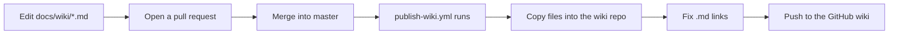

# Wiki guide

> **In short:** How these wiki pages are written, how long they can be, and how they reach the GitHub wiki.

## Where the wiki lives

- The source is the `docs/wiki/` folder in this repository.
- Every file is one wiki page. The file name is the page name (`Theme-System.md` becomes the "Theme System" page).
- `Home.md` is the wiki front page. `_Sidebar.md` is the menu on the right of every page.
- The folder is **flat**. GitHub wikis ignore sub folders, so do not add any.

## How it gets published



1. You change files in `docs/wiki/` and merge the pull request into `master`.
2. `.github/workflows/publish-wiki.yml` starts. It only runs when something inside `docs/wiki/` (or the workflow itself) changed.
3. It checks out the wiki repository (`<repo>.wiki.git`) next to the code.
4. It copies `docs/wiki/` over the wiki, so pages you deleted here are deleted there too.
5. It turns links like `(Theme-System.md)` into `(Theme-System)`, because the wiki has no `.md` in its URLs.
6. It commits and pushes. If nothing changed, it stops quietly.

You can also run it by hand from the **Actions** tab ("Publish wiki", then "Run workflow").

> **Note:** GitHub only creates the wiki repository after the first page exists. Before the first run, open the repo's **Wiki** tab once and save any page. After that the workflow owns the content.

> **Warning:** Do not edit pages on github.com. The next publish overwrites the wiki with `docs/wiki/`, so web edits are lost.

## Page template

Every page follows the same shape, so readers always know where to look:

```md
# Page title

> **In short:** one or two plain sentences.

## Files involved

A table: file path and what it does.

## How it works

A mermaid diagram, then numbered steps.

## How to change it

Common tasks as bullets.

## Good to know

Gotchas and rules.

## Related pages

Links to other wiki pages.
```

A page may skip a section that has nothing to say, but keep the order.

## Writing rules

- **Keep pages small.** Aim for under 150 lines. If a page grows past that, split it into two pages and link them.
- **Use easy words.** Short sentences. Explain a term the first time you use it.
- **One topic per page.** Link to other pages instead of repeating them.
- **At most two diagrams per page.** Use mermaid (`flowchart`, `sequenceDiagram`). GitHub renders them on the wiki.
- **Link pages with the `.md` name**, like `[Theme system](Theme-System.md)`. It works in the repo, and the workflow fixes it for the wiki.
- **Write file paths in backticks**, relative to the repo root, like `src/lib/posts.ts`.
- **Never use the em dash character.** Use a comma, colon, or a new sentence. This is a project wide rule.
- **Update the wiki in the same pull request** as the code change it describes.

## Adding a new page

1. Create `docs/wiki/My-New-Page.md` with the template above.
2. Add a link to it in `_Sidebar.md` and, if it is a main topic, in `Home.md`.
3. Merge. The workflow publishes it.

## Related pages

- [Home](Home.md)
- [Build and deploy](Build-and-Deploy.md)
